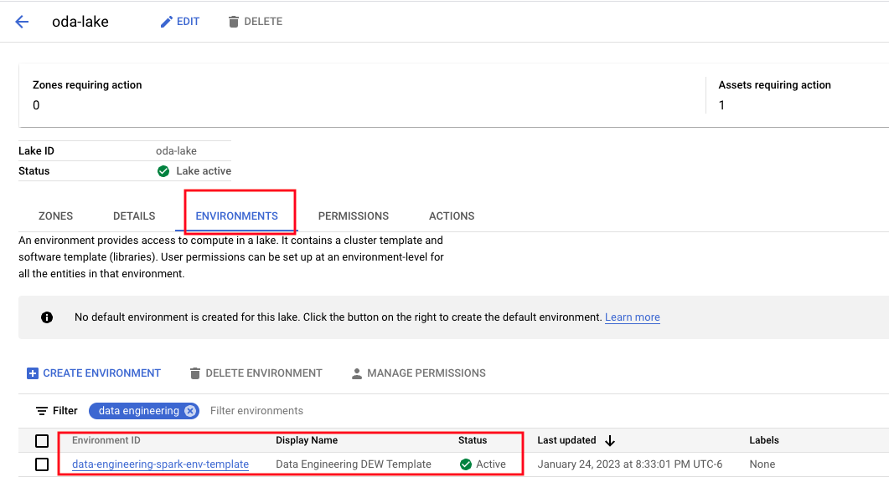
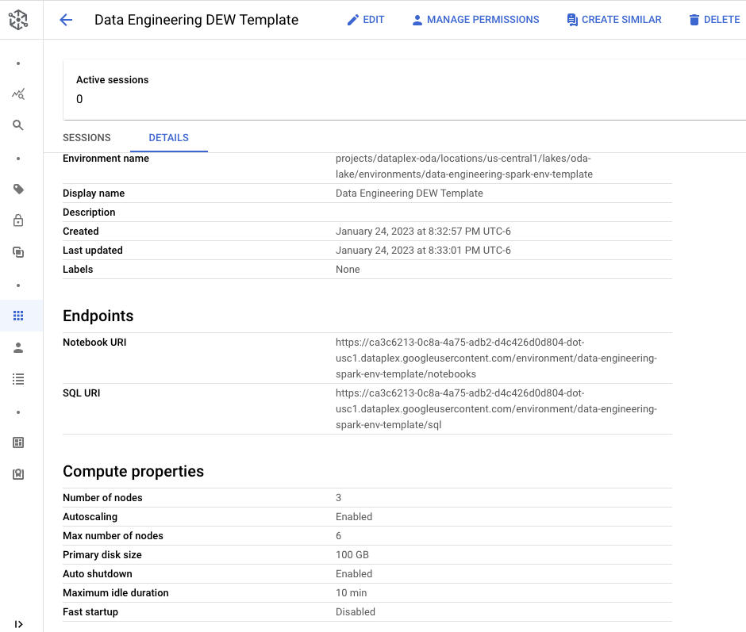
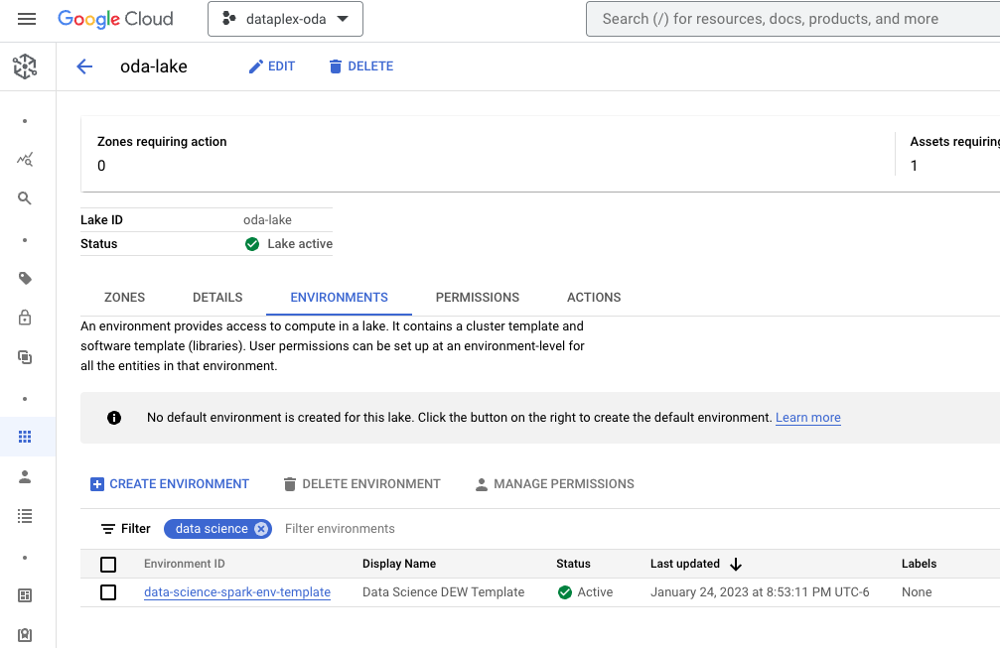
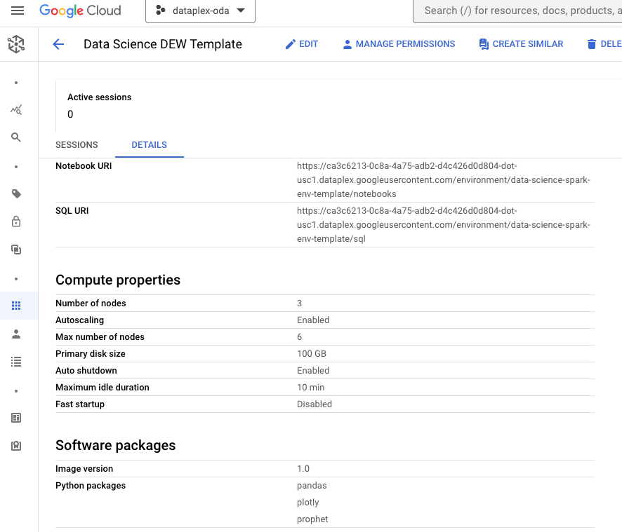

# M4: Create a Dataplex Exploration Environment - for Spark SQL and Jupyter notebook based metadata and data exploration

This module covers the featire "Dataplex Explore", and has a lab module.

### Prerequisites
Suceessful completion of prior modules

### Duration
~ 20 minutes or less

<hr>

## 1. About Data Exploration Workbench

Data Exploration Workbench in Dataplex (DEW) helps you interactively query fully-governed, high-quality data with one-click access to Spark SQL scripts and Jupyter notebooks. It lets you collaborate across teams with built-in publishing, sharing, and searching of coding assets.

Explore provisions, scales, and manages the serverless infrastructure required to run your Spark SQL scripts and notebooks using user credentials. You can operationalize your work with one-click serverless scheduling from the workbench.

<hr>

## 2. Terminology levelset
The following terms are used in the context of Data Exploration Workbench-

### Dataplex Environment
A Dataplex environment is essentially serverless compute resources for the Dataplex Spark SQL query workbench and Jupyter notebooks. 

### Dataplex Environment Template
An environment is a infrastructure specification for serverless Spark and can include libraries of interest by the end users. 

Environment templates are created and managed by a Dataplex administrator and they can authorize users to use environment templates by granting predefined roles.

### Dataplex Environment Session
When an authorized user chooses an environment template to run their queries and notebooks, Dataplex creates a user-specific active serverles Spark interactive session. There is no resource contention across users, as each session is exclusively tied to a single user. Depending on the environment configuration, a session automatically terminates if it's not used.

It takes a couple of minutes to start a new session per user. Once a session is active, it is used to run subsequent queries and notebooks for the same user. A session is active for a maximum of 10 hours.

Tip: Create a default environment with fast startup enabled to reduce the session startup time.
For an environment, only one session is created per user, which is shared by both Spark SQL scripts and Jupyter notebooks.

Dataplex uses user credentials within a session to run operations, such as querying the data from Cloud Storage and BigQuery. This allows for fine grained audit trail.

### Node
A node specifies the compute capacity in an environment configuration. One node maps to 4 Data Compute Units (DCU), which is comparable to 4 vCPUs and 16 GB of RAM.

### Default environment
You can create one default environment per lake with the ID default. A default environment must use a default configuration. A default configuration consists of the following:

1. Compute capacity of one node.
2. Primary disk size of 100 GB.
3. Auto session shutdown (auto shutdown time) set to 10 minutes of idle time.
4. The sessionSpec.enableFastStartup parameter, which is by default set to true. When this parameter is set to true, Dataplex pre-provisions the sessions for this environment so that they are readily available, which reduces the initial session startup time.
5. A fast startup session is a single node session, which is charged at Dataplex Premium Processing SKU rates similar to a regular session. A maximum of one always-on session is available for fast startup, which is charged even when not in use. This pre-created session is kept alive for 10 hours and shut off after that, and a new session is created.
6. If you don't choose an environment explicitly and if you have set up a default environment beforehand, then Dataplex uses the default environment to create sessions.

### SQL script
A SQL script is a Spark SQL script can be created and saved as content from Dataplex Exploration Workbench in a Dataplex lake. The scriptcan be shared with with other principals and can be scheduled to run as a batch serverless Spark job in Dataplex. Dataplex enables out-of-the-box Spark SQL access to (Dataplex Lake entities) tables that map to data in Cloud Storage and BigQuery.

### Notebook
A Python 3 notebook is a Jupyter notebook that is saved as content in Dataplex within a Dataplex lake. You can save a notebook as content within a lake and share it with other principals, or schedule it to run as a Dataproc Serverless Spark batch job in Dataplex.

For data in BigQuery, you can access BigQuery tables directly through Spark without using the %%bigquery magic command.

<hr>

<hr>

## 3. Lab: Create a Dataplex Exploration Workbench Environment Template

Note that the DEW environment template is merely metadata for an infrastructure configuration, and does not consume resources. Therefore, creation of a template is instantaneous.


### 3.1. Declare variables

Paste the folloing in Cloud Shell-
```

PROJECT_ID=`gcloud config list --format "value(core.project)" 2>/dev/null`
LOCATION="us-central1"
LAKE_NM="oda-lake"


```

### 3.2. Create a Data Engineering DEW Spark environment template

Paste the below in Cloud Shell-
```

gcloud dataplex environments create data-engineering-spark-env-template \
--project=$PROJECT_ID \
--location=$LOCATION \
--lake=$LAKE_NM \
--os-image-version=1.0 \
--display-name "Data Engineering DEW Template" \
--compute-node-count=3 \
--compute-max-node-count=6 

```

Review the environment in the Dataplex UI as shown below.

   
<br><br>

   
<br><br>


### 3.3. Create a Data Science DEW Spark environment template

Paste the below in Cloud Shell-
```

gcloud dataplex environments create data-science-spark-env-template-template \
--project=$PROJECT_ID \
--location=$LOCATION \
--lake=$LAKE_NM \
--os-image-version=1.0 \
--os-image-python-packages=pandas,plotly,prophet \
--display-name "Data Science DEW Template" \
--compute-node-count=3 \
--compute-max-node-count=6 

```

Review the environment in the Dataplex UI as shown below.

   
<br><br>

   
<br><br>

Note the libraries added to the enviorment template for bootstrapping.


<hr>
This concludes the lab module. Proceed to the next module.
<hr>


