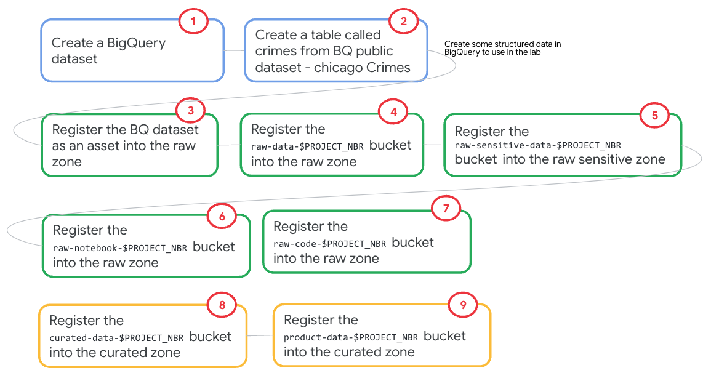
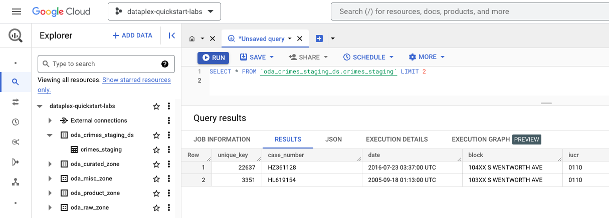
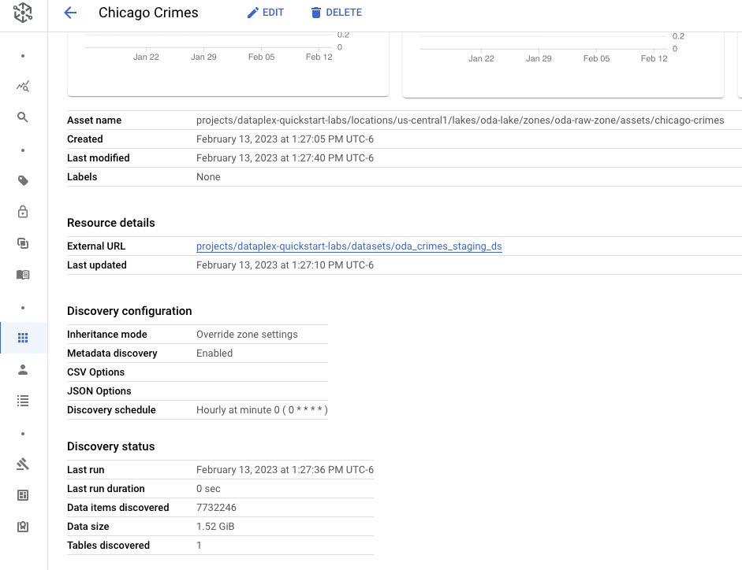
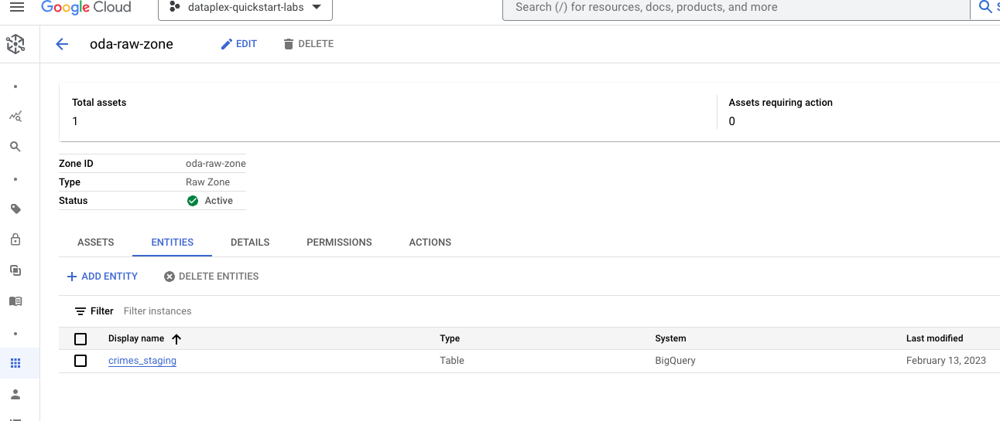
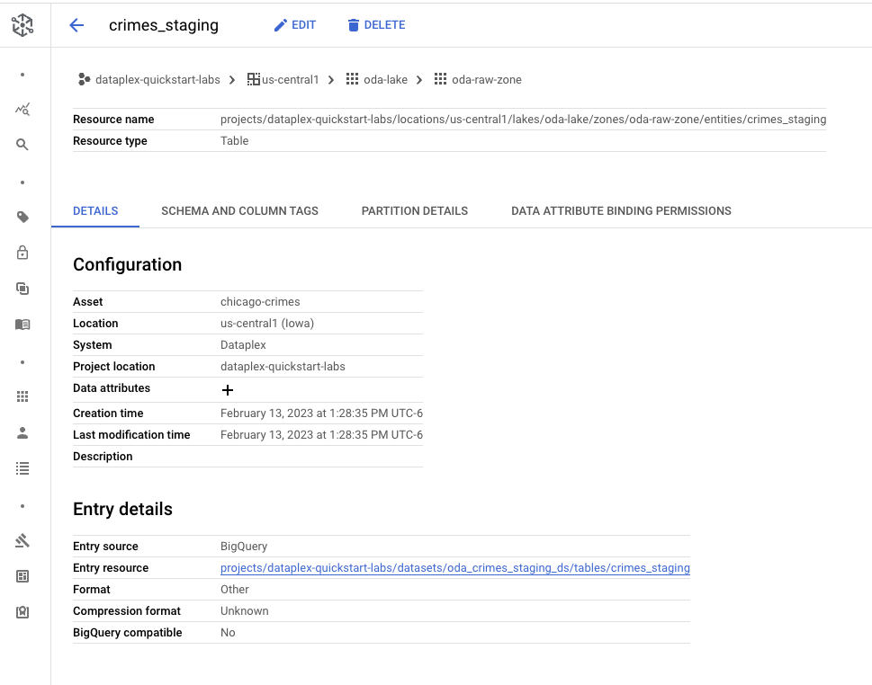
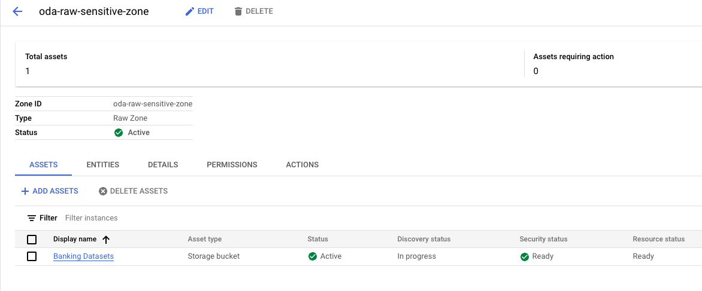
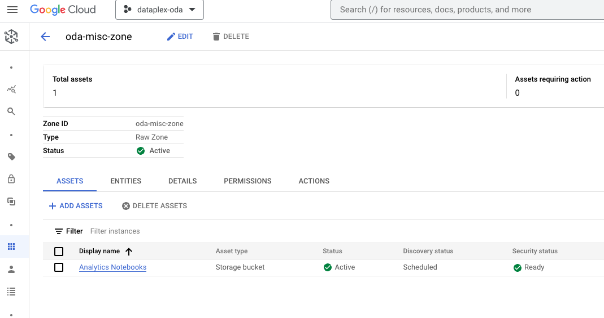

# M4: Register Assets into your Dataplex Lake Zones

In the previous module, we created a Dataplex Lake with a Dataproc Metastore Service, and Dataplex Zones with discovery enabled. <br>
In this module, we will register assets into the Dataplex Zones created. 

[Lab A: Register assets in BigQuery](module-05-register-assets-into-zones.md#1-lab-a-register-bigquery-datasets) <br>
[Lab B: Register assets in Cloud Storage](module-05-register-assets-into-zones.md#2-lab-b-register-assets-in-google-cloud-storage)

### Prerequisites
Completion of prior modules

### Approximate duration
20 minutes or less

### Pictorial overview of lab module

   
<br><br>

   
<br><br>

<hr>


## 1. Lab A: Register BigQuery Datasets

In this lab sub-module, we will create a BigQuery dataset, load some data into a BigQuery table in the dataset we created and register the dataset as an asset into the Dataplex raw zone we created. We will use the Chicago Crimes public dataset in BigQuery for this lab sub-module.

### 1.1. Declare variables

Paste into Cloud Shell-
```

PROJECT_ID=`gcloud config list --format "value(core.project)" 2>/dev/null`
PROJECT_NBR=`gcloud projects describe $PROJECT_ID | grep projectNumber | cut -d':' -f2 |  tr -d "'" | xargs`
UMSA_FQN="lab-sa@${PROJECT_ID}.iam.gserviceaccount.com"
LOCATION="us-central1"
METASTORE_NM="lab-dpms-$PROJECT_NBR"
LAKE_NM="oda-lake"
DATA_RAW_ZONE_NM="oda-raw-zone"
DATA_RAW_SENSITIVE_ZONE_NM="oda-raw-sensitive-zone"
DATA_CURATED_ZONE_NM="oda-curated-zone"
DATA_PRODUCT_ZONE_NM="oda-product-zone"
MISC_RAW_ZONE_NM="oda-misc-zone"

CRIMES_ASSET="chicago-crimes"
CRIMES_STAGING_DS="oda_crimes_staging_ds"

```

### 1.2. List BigQuery Datasets

Paste this command in Cloud Shell to list BQ datasets-
```
bq ls --format=pretty
```

These datasets got created automatically by Dataplex when you created zones in the prior module.

Author's results-
```
+----------------------+
|      datasetId       |
+----------------------+
| oda_consumption_zone |
| oda_curated_zone     |
| oda_misc_zone        |
| oda_raw_zone         |
+----------------------+
```

Note that these datasets were automatically created and each of them map to a Dataplex zone we created in the previous module.

### 1.3. Create a "crimes" BigQuery Dataset

```
bq --location=$LOCATION_MULTI mk \
    --dataset \
    $PROJECT_ID:$CRIMES_STAGING_DS
```

Lets list BQ datasets again-
```
bq ls --format=pretty
```

You should see the new dataset created-

Author's results-
```
+-----------------------+
|       datasetId       |
+-----------------------+
| oda_crimes_staging_ds | <-- We just created this
| oda_curated_zone      | <-- Auto-created by Dataplex when we created zones
| oda_misc_zone         | <-- Auto-created by Dataplex when we created zones
| oda_product_zone      | <-- Auto-created by Dataplex when we created zones
| oda_raw_zone          | <-- Auto-created by Dataplex when we created zones
+-----------------------+
```

### 1.4. Load some data into the newly created "crimes" BigQuery dataset from a BigQuery public dataset

Paste this command in Cloud Shell to create a table-
```
bq --location=$LOCATION_MULTI query \
--use_legacy_sql=false \
"CREATE OR REPLACE TABLE $CRIMES_STAGING_DS.crimes_staging AS SELECT * FROM bigquery-public-data.chicago_crime.crime"
```

Reload the BQ UI, you should see the table created. Query the table-
```
SELECT * FROM `oda_crimes_staging_ds.crimes_staging` LIMIT 1000
```

Author's output:
   
<br><br>


### 1.5. Register the crimes BigQuery Dataset as an asset into the RAW zone

Paste this command in Cloud Shell to register contents of BQ datasets (currently empty) into corressponding zones-

```

gcloud dataplex assets create $CRIMES_ASSET \
--location=$LOCATION \
--lake=$LAKE_NM \
--zone=$DATA_RAW_ZONE_NM \
--resource-type=BIGQUERY_DATASET \
--resource-name=projects/$PROJECT_ID/datasets/$CRIMES_STAGING_DS \
--discovery-enabled \
--discovery-schedule="0 * * * *" \
--display-name 'Chicago Crimes'

```

### 1.6. Switch to the Dataplex UI, Manage->ODA-Lake->ODA-RAW-ZONE->Assets

Review the various tabs of the asset registered.

   
<br><br>


   
<br><br>

   
<br><br>


### 1.7. In the Dataplex Assets UI, review the "entities" tab

The physical BigQuery table is called an entity in this case, and is listed.

   
<br><br>

   
<br><br>

## 2. Lab B: Register assets in Google Cloud Storage

In this lab sub-module, we will simply add the storage buckets created via Terraform with datasets in them, into the raw zone, and curated zone, depending on format.


### 2.1a. Register data assets into Raw Zone: oda-raw-zone

#### 2.1a.1. Assets to be registered

The following are the raw data assets to be registered into the Dataplex Raw Zone called oda-raw-zone. The data assets are located at -<br>
GCS Path: gs://raw-data-PROJECT_NBR

| Domain Use Case | Type | Format | GCS directory | 
| -- | :--- |:--- | :--- | 
| Chicago Crimes Analytics | Reference Data | CSV | chicago-crimes | 
| Icecream Sales Forecasting | Transactional Data | CSV | icecream-sales-forecasting | 
| Telco Customer Churn Prediction | Training Data | CSV | telco-customer-churn-prediction/machine_learning_training |
| Telco Customer Churn Prediction | Scoring Data | CSV | telco-customer-churn-prediction/machine_learning_scoring | 
| Cell Tower Anomaly Detection | Reference Data | CSV | cell_tower_anomaly_detection/reference_data | 
| Cell Tower Anomaly Detection | Transactional Data | CSV | cell_tower_anomaly_detection/transactions_data | 


#### 2.1a.2. Register the assets

To register the data assets, we will merely register the buckets and the data assets will automatically get discovered and entities registered. We will review entities created in the next lab module.

```
gcloud dataplex assets create misc-datasets \
--location=$LOCATION \
--lake=$LAKE_NM \
--zone=$DATA_RAW_ZONE_NM \
--resource-type=STORAGE_BUCKET \
--resource-name=projects/$PROJECT_ID/buckets/raw-data-$PROJECT_NBR \
--discovery-enabled \
--discovery-schedule="0 * * * *" \
--display-name 'Miscellaneous Datasets'
```

#### 2.1a.3. Review the assets registered in the Dataplex UI

Navigate to Dataplex UI -> Manage -> ODA-LAKE -> ODA-RAW-ZONE -> Assets & familiarize yourself with the various tabs and entries.

   
<br><br>

<hr>

<br>

### 2.1b. Register data assets into Raw Zone: oda-raw-sensitive-zone

#### 2.1b.1. Assets to be registered

The following are the raw data assets to be registered into the Dataplex Raw Zone called oda-raw-sensitive-zone. The data assets are located at -<br>
GCS Path: gs://raw-data-sensitive-PROJECT_NBR

| Domain Use Case | Format | GCS directory | 
| -- | :--- | :--- | 
| Banking - Customer Master Data | CSV | banking/customers_raw/customers | 
| Banking - Credit Card Customer Customer  | CSV | banking/customers_raw/credit_card_customers | 


#### 2.1b.2. Register the assets

To register the data assets, we will merely register the buckets and the data assets will automatically get discovered and entities registered. We will review entities created in the next lab module.

```
gcloud dataplex assets create banking-datasets \
--location=$LOCATION \
--lake=$LAKE_NM \
--zone=$DATA_RAW_SENSITIVE_ZONE_NM \
--resource-type=STORAGE_BUCKET \
--resource-name=projects/$PROJECT_ID/buckets/raw-data-sensitive-$PROJECT_NBR \
--discovery-enabled \
--discovery-schedule="0 * * * *" \
--csv-delimiter="|" \
--display-name 'Banking Datasets'
```

#### 2.1b.3. Review the assets registered in the Dataplex UI

Navigate to Dataplex UI -> Manage -> ODA-LAKE -> ODA-RAW-SENSITIVE-ZONE -> Assets & familiarize yourself with the various tabs and entries.

   
<br><br>

<hr>

<br>

### 2.2. Register data assets into Curated Zone: oda-curated-zone

#### 2.2.1. Assets to be registered

The following are the curated data assets to be registered into the Dataplex Curated Zone called oda-curated-zone. The data assets are located at -<br>
GCS Path: gs://curated-data-PROJECT_NBR

| Domain Use Case | Format | GCS directory | 
| -- | :--- | :--- | 
| Retail Transactions Anomaly Detection | Parquet | retail-transactions-anomaly-detection/ | 
| Cell Tower Anomaly Detection | Parquet|| cell-tower-anomaly-detection/master_data |


#### 2.2.2. Register the assets

To register the data assets, we will merely register the buckets and the data assets will automatically get discovered and entities registered. We will review entities created in the next lab module.

```
gcloud dataplex assets create misc-datasets \
--location=$LOCATION \
--lake=$LAKE_NM \
--zone=$DATA_CURATED_ZONE_NM \
--resource-type=STORAGE_BUCKET \
--resource-name=projects/$PROJECT_ID/buckets/curated-data-$PROJECT_NBR \
--discovery-enabled \
--discovery-schedule="0 * * * *" \
--display-name 'Miscellaneous Datasets'
```

#### 2.2.3. Review the assets registered in the Dataplex UI

Navigate to Dataplex UI -> Manage -> ODA-LAKE -> ODA-CURATED-ZONE -> Assets & familiarize yourself with the various tabs and entries.

   
<br><br>

<hr>

<br>

### 2.3. Register notebooks assets into Raw Zone: oda-misc-zone

#### 2.3.1. Assets to be registered

The following are the notebook assets to be registered into the Dataplex Raw Zone called oda-misc-zone. The notebook assets are located at -<br>
GCS Path: gs://raw-notebook-PROJECT_NBR

| Domain Use Case | Format | GCS directory | 
| -- | :--- | :--- | 
| Chicago Crimes Analytics | .pynb | chicago-crimes-analysis | 
| Icecream Sales Forecasting | .pynb | icecream-sales-forecasting |
| Retail Transactions Anomaly Detection | .ipynb | retail-transactions-anomaly-detection |
| Telco Customer Churn Prediction | .pynb | telco-customer-churn-prediction | 


To see the listing in Cloud Shell, paste the below command-
```
gsutil ls gs://raw-notebook-$PROJECT_NBR
```
The author's output is:<br>

gs://raw-notebook-36819656457/chicago-crimes-analysis/<br>
gs://raw-notebook-36819656457/icecream-sales-forecasting/<br>
gs://raw-notebook-36819656457/retail-transactions-anomaly-detection/<br>
gs://raw-notebook-36819656457/telco-customer-churn-prediction/


#### 2.3.2. Register the assets

To register the notebook assets, we will merely register the buckets and the notebook assets will automatically get discovered and entities registered. We will review entities created in the next lab module.

```
gcloud dataplex assets create notebooks \
--location=$LOCATION \
--lake=$LAKE_NM \
--zone=$MISC_RAW_ZONE_NM \
--resource-type=STORAGE_BUCKET \
--resource-name=projects/$PROJECT_ID/buckets/raw-notebook-$PROJECT_NBR \
--display-name 'Analytics Notebooks'
```

#### 2.3.3. Review the assets registered in the Dataplex UI

Navigate to Dataplex UI -> Manage -> ODA-LAKE -> ODA-MISC-ZONE -> Assets & familiarize yourself with the various tabs and entries.

   
<br><br>

<hr>


### 2.4. Register code assets into Raw Zone: oda-misc-zone

#### 2.4.1. Assets to be registered

The following are the code assets to be registered into the Dataplex Raw Zone called oda-misc-zone. The code assets are located at -<br>
GCS Path: gs://raw-code-PROJECT_NBR<br>

To see the listing in Cloud Shell, paste the below command-
```
gsutil ls -r gs://raw-code-$PROJECT_NBR
```
The author's output is:<br>
<br>
gs://raw-code-36819656457/retail-transactions-anomaly-detection/retail-transactions-anomaly-detection.sql<br>


#### 2.4.2. Register the assets

To register the notebook assets, we will merely register the buckets and the notebook assets will automatically get discovered and entities registered. We will review entities created in the next lab module.

```
gcloud dataplex assets create code-assets \
--location=$LOCATION \
--lake=$LAKE_NM \
--zone=$MISC_RAW_ZONE_NM \
--resource-type=STORAGE_BUCKET \
--resource-name=projects/$PROJECT_ID/buckets/raw-code-$PROJECT_NBR \
--display-name 'Code Assets'
```

#### 2.4.3. Review the assets registered in the Dataplex UI

Navigate to Dataplex UI -> Manage -> ODA-LAKE -> ODA-MISC-ZONE -> Assets & familiarize yourself with the various tabs and entries.

   
<br><br>

<hr>

### 2.5. Register empty bucket, as asset into Curated Zone: oda-consumption-zone

#### 2.5.1. Assets to be registered

There are not objects to be registered into the Dataplex Raw Zone called oda-consumption-zone. The asset is the GCS bucket located at -<br>
GCS Path: gs://product-data-PROJECT_NBR<br>


#### 2.5.2. Register the bucket as an asset

To register the notebook assets, we will merely register the buckets and the notebook assets will automatically get discovered and entities registered. We will review entities created in the next lab module.

```
gcloud dataplex assets create consumption-assets \
--location=$LOCATION \
--lake=$LAKE_NM \
--zone=$DATA_PRODUCT_ZONE_NM \
--resource-type=STORAGE_BUCKET \
--resource-name=projects/$PROJECT_ID/buckets/product-data-$PROJECT_NBR \
--discovery-enabled \
--discovery-schedule="0 * * * *" \
--display-name 'Product Assets'
```

#### 2.5.3. Review the assets registered in the Dataplex UI

Navigate to Dataplex UI -> Manage -> ODA-LAKE -> ODA-PRODUCT-ZONE -> Assets & familiarize yourself with the various tabs and entries. At the onset of this lab, the product zone dos not have any assets.

<hr>


<br>

<hr>

This concludes the lab module. In the next lab module, we will review automated discovery of assets, schema inference, and external table creation.

<hr>


