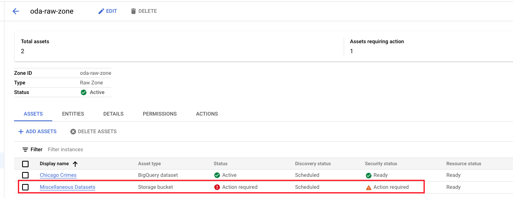

# M6: Automated discovery, schema inference and external table creation

When a Dataplex Zone's discovery option is enabled, and assets are added to the Dataplex Zone of a Dataplex Lake that has a Dataproc Metastore Service (DPMS) attached with Data Catalog Sync enabled, the following happen automatically-
1. Assets will be discovered
2. Schema will be inferred for objects in Cloud Storage
3. External table definition will be created, based on schema inference in Dataproc Metastore Service (Hive Metastore Service) 
4. External table definition will ALSO be created, based on schema inference in BigQuery
5. The tables will be available as Dataplex Zone level entities
6. The tables will be cataloged in Data Catalog and will be searchable

This lab module covers the above for assets registered in the prior module.

### Learning units

1. [Lab - Review discovered Cloud Storage based entities in Dataplex](module-06-discovery.md#1-lab---review-discovered-cloud-storage-based-entities-in-dataplex)
2. [Lab - Review external tables created for Cloud Storage based entities by Dataplex, in BigQuery](module-06-discovery.md#2-lab---review-external-tables-created-for-cloud-storage-based-entities-by-dataplex-in-bigquery)
3. [Lab - Review external tables created for Cloud Storage based entities by Dataplex, in Dataproc Metastore Service](module-06-discovery.md#3-lab---review-external-tables-created-for-cloud-storage-based-entities-by-dataplex-in-dataproc-metastore-service)

### Prerequisites

Completion of prior modules

### Duration

~ 30 minutes

<hr>


## 1. Lab - Review discovered Cloud Storage based entities in Dataplex

### 1.1. Discovery of data assets in the Raw Zone: oda-raw-zone

#### 1.1.1. UI view

Navigate to the Dataplex Zones UI for ODA-RAW-ZONE, and you will see "Miscellaneous Datasets" asset. Notice that it has an "Action required" flag.

   
<br><br>

<hr>

#### 1.1.2. Review entities automatically created

Click on "Entities". You should see multiple GCS based tables. Their names are based off of the directory names in GCS.

   
<br><br>

<hr>

#### 1.1.3. Review a GCS based entity's details 

Click on "icecream_sales_forecasting"; And then "Details". Review the details.

   
<br><br>

Click on "SCHEMA AND COLUMN TAGS". Review the schema inferred.

   
<br><br>

<hr>

### 1.2. Discovery of data assets in the Raw Zone: oda-raw-sensitive-zone

#### 1.2.1. UI view

Navigate to the Dataplex Zones UI for ODA-RAW-SENSITIVE-ZONE, and you will see "Banking Datasets" asset. 

   
<br><br>

<hr>

#### 1.2.2. Review entities automatically createdd

Click on "Entities". You should see multiple GCS based tables. Their names are based off of the directory names in GCS.

   
<br><br>

<hr>

#### 1.2.3. Review a GCS based entity's details 

Click on the entity "banking_customers_raw_customers; And then "Details". Review the details.

   
<br><br>

#### 1.2.4. Review a GCS based entity's schema inference

Click on "SCHEMA AND COLUMN TAGS". Review the schema inferred.

   
<br><br>


#### 1.2.5. Review a GCS based entity's partition inference 

Click on "PARTITION DETAILS". Review the partition inferred.

   
<br><br>

Click on "VIEW PARTITION FILES"

#### 1.2.6. Review the files in GCS & observe how it all ties together


   
<br><br>

<hr>


## 2. Lab - Review external tables created for Cloud Storage based entities by Dataplex, in BigQuery

## 3. Lab - Review external tables created for Cloud Storage based entities by Dataplex, in Dataproc Metastore Service

### 3.1. Explore databases in Dataproc Metatsore

1. Click on Dataplex Explore icon on the left navigation bar
 
   
<br><br>

2. Leaving all things default, click on the SQL editor "+" sign and type the below in it

```
show databases;
```

<br><br>

3. Let it run. 

   
<br><br>

4. Results

   
<br><br>

<hr>

### 3.2. Explore tables in Dataproc Metatsore in the raw zone

#### 3.2.1. List tables in Dataplex Explore Spark SQL editor

```
SHOW tables in oda_raw_zone;
```

   
<br><br>

#### 3.2.2. Query an external table in Dataplex Explore Spark SQL editor

```
SELECT * FROM 	
oda_raw_zone.chicago_crimes_reference_data
LIMIT 2
```

   
<br><br>

<hr>

### 3.3. Explore tables in Dataproc Metatsore in the raw sensitive zone

#### 3.3.1. List tables in Dataplex Explore Spark SQL editor

```
SHOW tables in 	oda_raw_sensitive_zone;
```

   
<br><br>

#### 3.3.2. Query a table in Dataplex Explore Spark SQL editor

```
SELECT * FROM oda_raw_sensitive_zone.banking_customers_raw_customers LIMIT 2;
```

   
<br><br>

<hr>

### 3.4. Explore tables in Dataproc Metatsore in the curated zone

#### 3.4.1. List tables in Dataplex Explore Spark SQL editor

```
SHOW tables in 	oda_curated_zone;
```

   
<br><br>

#### 3.4.2. Query a table in Dataplex Explore Spark SQL editor

```
SELECT * FROM oda_curated_zone.retail_transactions_anomaly_detection LIMIT 2;
```

   
<br><br>

<hr>
<hr>

============

### 2.4. Query the same (external table) entity in the BigQuery UI
Switch to the BigQuery UI and to the dataset called oda_raw_zone. This dataset was automatically created by Dataplex when we created a zone. Notice the two tables listed there. Run a query on the Icecream Sales Forecasting table and review the results.

```
SELECT * FROM `oda_raw_zone.icecream_sales_forecasting` LIMIT 1000
```

   
<br><br>

<hr>


<hr>

### 3. Discovery of data assets in the Raw Zone: oda-raw-sensitive zone

<hr>

### 4. Discovery of data assets in the Curated Zone: oda-curated-zone

Review the asset, entities, schema, external table in BigQuery for assets in the Dataplex oda-curated-zone. This zone has external tables in Parquet, that are automatically registered as entities, again with external table definitions in BigQuery as well as in Dataproc Metastore Service.

<hr>

### 5. Discovery of non-data assets in the RAW Zone: oda-misc-zone

Review the asset, entities, in the Dataplex oda-misc-zone. Notice that Dataplex does not do schema inference, create external tables etc and categorizes the assets as of "fileset" type.
<br>

   
<br><br>

<hr>
This concludes the lab module. Proceed to the next module, where we will create a Dataplex "Environment" lanuch up a Jupyter notebook and explore metadata.
<hr>
