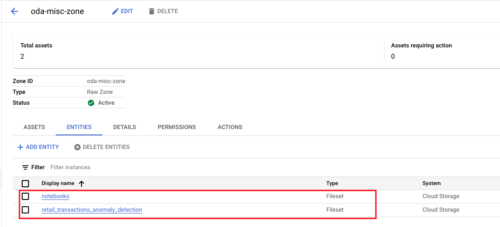

# M6: Automated discovery, schema inference and external table creation

When a Dataplex Zone's discovery option is enabled, and assets are added to the Dataplex Zone of a Dataplex Lake that has a Dataproc Metastore Service (DPMS) attached with Data Catalog Sync enabled, the following happen automatically-
1. Assets will be discovered
2. Schema will be inferred for objects in Cloud Storage
3. External table definition will be created, based on schema inference in Dataproc Metastore Service (Hive Metastore Service) 
4. External table definition will ALSO be created, based on schema inference in BigQuery
5. The tables will be available as Dataplex Zone level entities
6. The tables will be cataloged in Data Catalog and will be searchable

This lab module covers the above for assets registered in the prior module.

## 1. Lab - Launch Dataplex Explore notebook


<hr>

## 2. Lab - discovery of data assets in the Raw Zone: oda-raw-zone

### 2.1. Review asset - Miscelleaneous Dataset in raw zone
Navigate to the Dataplex Zones UI for ODA-RAW-ZONE, and you will see "Miscellaneous Datasets" asset. Notice that it has an "Action required" flag.

   
<br><br>

<hr>

### 2.2. Review entities automatically createdd

Click on "Entities". You should see multiple GCS based tables. Their names are based off of the directory names in GCS.

   
<br><br>

<hr>

### 2.3. Review a GCS based entity's details 
Click on "icecream_sales_forecasting"; And then "Details". Review the details.

   
<br><br>

Click on "SCHEMA AND COLUMN TAGS". Review the schema inferred.

   
<br><br>

<hr>

### 2.4. Query the same (external table) entity in the BigQuery UI
Switch to the BigQuery UI and to the dataset called oda_raw_zone. This dataset was automatically created by Dataplex when we created a zone. Notice the two tables listed there. Run a query on the Icecream Sales Forecasting table and review the results.

```
SELECT * FROM `oda_raw_zone.icecream_sales_forecasting` LIMIT 1000
```

   
<br><br>

<hr>

### 2.5. Query the same (external table) entity in the Dataplex Explore notebook

# TODO


<hr>

### 3. Discovery of data assets in the Raw Zone: oda-raw-sensitive zone

<hr>

### 4. Discovery of data assets in the Curated Zone: oda-curated-zone

Review the asset, entities, schema, external table in BigQuery for assets in the Dataplex oda-curated-zone. This zone has external tables in Parquet, that are automatically registered as entities, again with external table definitions in BigQuery as well as in Dataproc Metastore Service.

<hr>

### 5. Discovery of non-data assets in the RAW Zone: oda-misc-zone

Review the asset, entities, in the Dataplex oda-misc-zone. Notice that Dataplex does not do schema inference, create external tables etc and categorizes the assets as of "fileset" type.
<br>

   
<br><br>

<hr>
This concludes the lab module. Proceed to the next module, where we will create a Dataplex "Environment" lanuch up a Jupyter notebook and explore metadata.
<hr>
