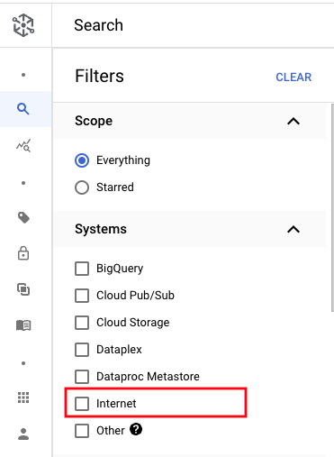
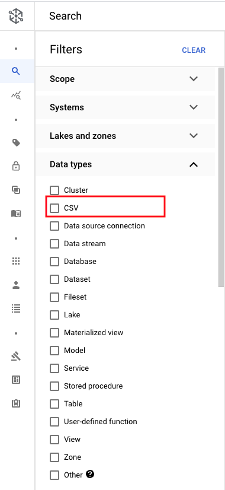
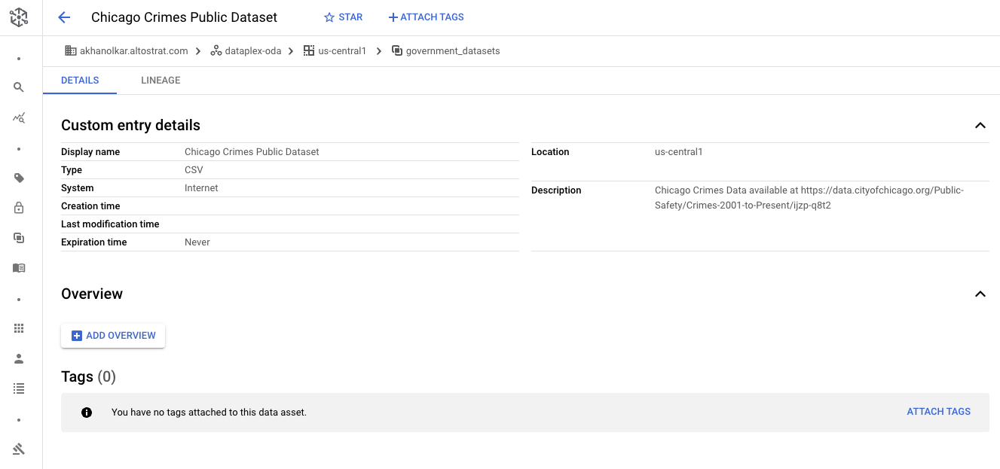

# M7: Create a custom entry in Dataplex - Data Catalog

In this lab module, we will learn how to create entries in Cloud Catalog, manually, using the Metadata API. We will first create an entry group and then an entry belonging to the group. In a subsequent lab, we will use it to demonstrate lineage.


## 1. Create custom entry group

In this section, we will create an entry group called "Government Datasets". Paste the below in Cloud Shell.

```
PROJECT_ID=`gcloud config list --format "value(core.project)" 2>/dev/null`
PROJECT_NBR=`gcloud projects describe $PROJECT_ID | grep projectNumber | cut -d':' -f2 |  tr -d "'" | xargs`
LOCATION="us-central1"

ENTRY_GROUP_ID="government_datasets"

rm -rf requestCustomEntryGroup.json
echo "{ \"displayName\": \"Government Datasets\" }" >>  requestCustomEntryGroup.json

curl -X POST \
    -H "Authorization: Bearer $(gcloud auth print-access-token)" \
    -H "x-goog-user-project: $PROJECT_ID" \
    -H "Content-Type: application/json; charset=utf-8" \
    -d @requestCustomEntryGroup.json \
    "https://datacatalog.googleapis.com/v1/projects/$PROJECT_ID/locations/$LOCATION/entryGroups?entryGroupId=$ENTRY_GROUP_ID"

```

<hr>

## 2. Create custom entry

In this section, we will create an entry, as detailed in the table below, for the "Chicago Crimes Dataset", as part of the entry group "Government Datasets", above. 

| Key | Value  | 
| -- | :--- | 
| Entry ID | chicago_crimes_dataset |
| Entry Group | government_datasets |
| User Specified Type | CSV |
| User Specified System | Internet |
| Display Name | Chicago Crimes Public Dataset |
| Decsctiption | Chicago Crimes Data available at https://data.cityofchicago.org/Public-Safety/Crimes-2001-to-Present/ijzp-q8t2 |


Paste the below in Cloud Shell.
```
ENTRY_ID="chicago_crimes_dataset"

rm -rf requestCustomEntry.json
echo "{\"description\": \"Chicago Crimes Data available at https://data.cityofchicago.org/Public-Safety/Crimes-2001-to-Present/ijzp-q8t2\",\"displayName\": \"Chicago Crimes Public Dataset\",\"user_specified_type\": \"CSV\",\"user_specified_system\": \"Internet\"}" >>  requestCustomEntry.json

curl -X POST \
    -H "Authorization: Bearer $(gcloud auth print-access-token)" \
    -H "x-goog-user-project: $PROJECT_ID" \
    -H "Content-Type: application/json; charset=utf-8" \
    -d @requestCustomEntry.json \
    "https://datacatalog.googleapis.com/v1/projects/$PROJECT_ID/locations/$LOCATION/entryGroups/$ENTRY_GROUP_ID/entries?entryId=$ENTRY_ID"
    
```

<hr>

## 3. Catalog Search UI walkthrough 

Navigate to Dataplex in the Cloud Console and to "Search" on the left navigatio menu.

   
<br><br>

   
<br><br>

   
<br><br>

   
<br><br>

<hr>
This concludes the lab module. You can proceed to the next module.
<hr>
