# M7: Create a custom entry in Dataplex - Data Catalog

In this lab module, we will learn how to create entries in Cloud Catalog, manually, using the Metadata API. We will first create an entry group and then an entry belonging to the group. In a subsequent lab, we will use it to demonstrate lineage.


## 1. Create custom entry group

In this section, we will create an entry group called "Government Datasets". Paste the below in Cloud Shell.

```
PROJECT_ID=`gcloud config list --format "value(core.project)" 2>/dev/null`
PROJECT_NBR=`gcloud projects describe $PROJECT_ID | grep projectNumber | cut -d':' -f2 |  tr -d "'" | xargs`
LOCATION="us-central1"

ENTRY_GROUP_ID="government_datasets"

rm -rf requestCustomEntryGroup.json
echo "{ \"displayName\": \"Government Datasets\" }" >>  requestCustomEntryGroup.json

curl -X POST \
    -H "Authorization: Bearer $(gcloud auth print-access-token)" \
    -H "x-goog-user-project: $PROJECT_ID" \
    -H "Content-Type: application/json; charset=utf-8" \
    -d @requestCustomEntryGroup.json \
    "https://datacatalog.googleapis.com/v1/projects/$PROJECT_ID/locations/$LOCATION/entryGroups?entryGroupId=$ENTRY_GROUP_ID"

```

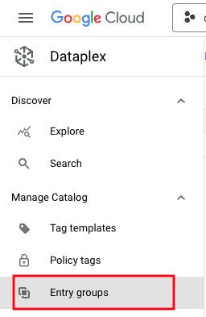   
<br><br>


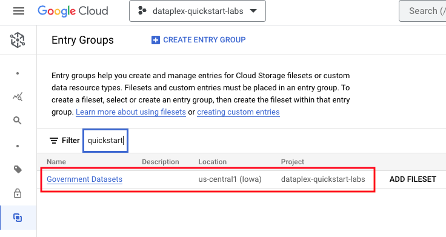   
<br><br>


<hr>

## 2. Create custom entry

In this section, we will create an entry, as detailed in the table below, for the "Chicago Crimes Dataset", as part of the entry group "Government Datasets", above. 

| Key | Value  | 
| -- | :--- | 
| Entry ID | chicago_crimes_dataset |
| Entry Group | government_datasets |
| User Specified Type | CSV |
| User Specified System | Internet |
| Display Name | Chicago Crimes Public Dataset |
| Decsctiption | Chicago Crimes Data available at https://data.cityofchicago.org/Public-Safety/Crimes-2001-to-Present/ijzp-q8t2 |


Paste the below in Cloud Shell.
```
ENTRY_ID="chicago_crimes_dataset"

rm -rf requestCustomEntry.json
echo "{\"description\": \"Chicago Crimes Data available at https://data.cityofchicago.org/Public-Safety/Crimes-2001-to-Present/ijzp-q8t2\",\"displayName\": \"Chicago Crimes Public Dataset\",\"user_specified_type\": \"CSV\",\"user_specified_system\": \"Internet\"}" >>  requestCustomEntry.json

curl -X POST \
    -H "Authorization: Bearer $(gcloud auth print-access-token)" \
    -H "x-goog-user-project: $PROJECT_ID" \
    -H "Content-Type: application/json; charset=utf-8" \
    -d @requestCustomEntry.json \
    "https://datacatalog.googleapis.com/v1/projects/$PROJECT_ID/locations/$LOCATION/entryGroups/$ENTRY_GROUP_ID/entries?entryId=$ENTRY_ID"
    
```

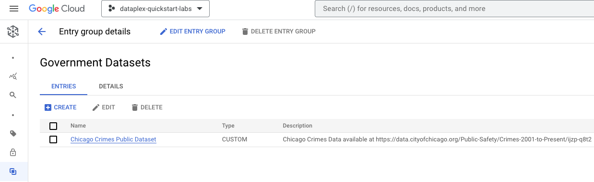   
<br><br>

<hr>

## 3. Catalog Search UI walkthrough 

Navigate to Dataplex in the Cloud Console and to "Search" on the left navigation menu.

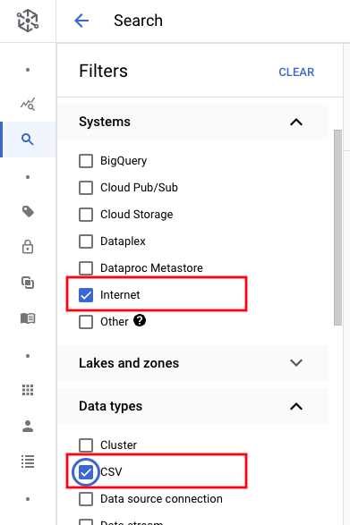   
<br><br>

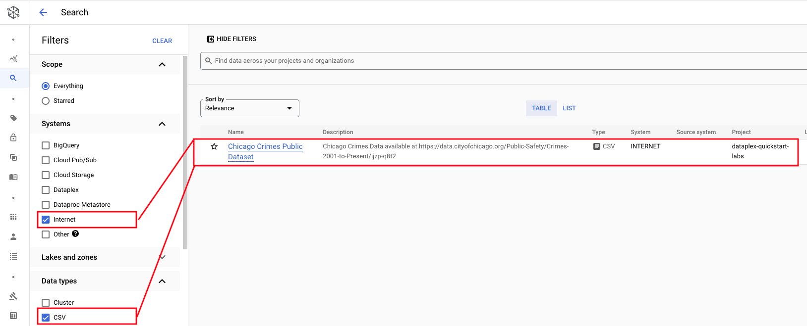   
<br><br>

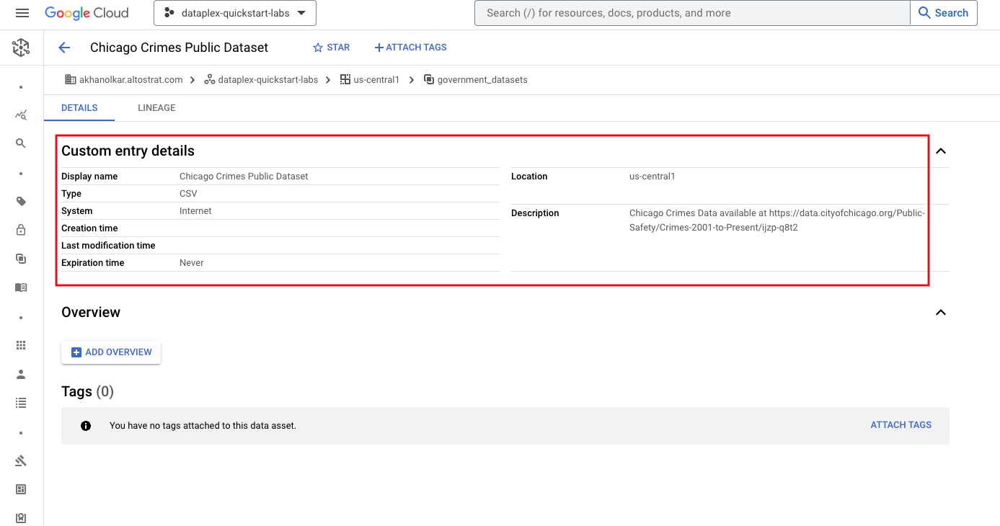   
<br><br>

<hr>

## 4. Add a Data Steward for the custom Catalog entry

Where we left off in the Catalog Entry listing, click on the steward icon on the extreme right and assign yourself as the steward, as shown below.

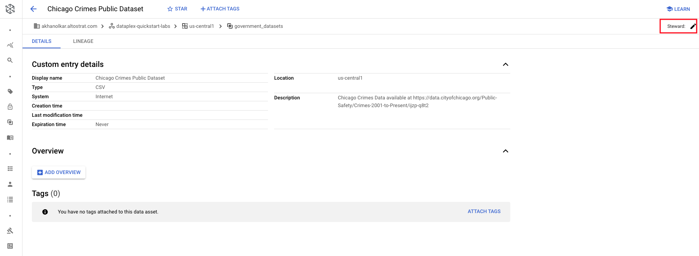   
<br><br>

   
<br><br>

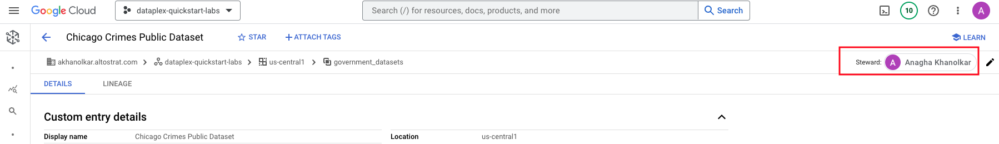   
<br><br>

<hr>

## 5. Create a Tag Template
Follow the steps below to create a Tag Template-

   
<br><br>

   
<br><br>

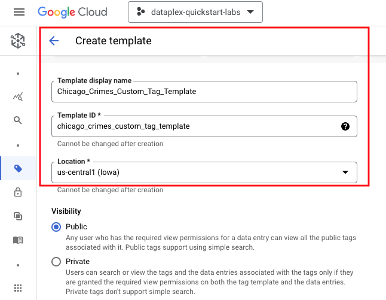   
<br><br>

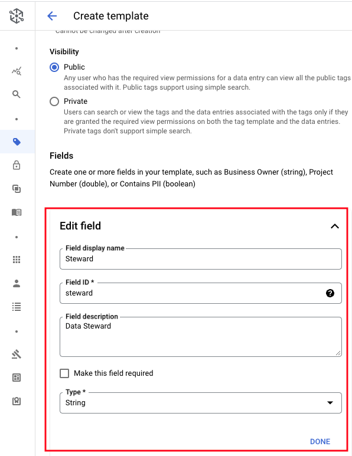   
<br><br>

   
<br><br>

   
<br><br>

<hr>

## 6. Associate the Tag Template to the custom Catalog entry

Associate the tag to the custom entry as shown below, and populate. Follow the steps in the screenshots in the exact order.

   
<br><br>

   
<br><br>


   
<br><br>

   
<br><br>

   
<br><br>


   
<br><br>


   
<br><br>

<hr>

## 7. Add an overview of the dataset to the custom Catalog entry

Click on "Overview" and ass the following blurb & save-
```
This dataset reflects reported incidents of crime (with the exception of murders where data exists for each victim) that occurred in the City of Chicago from 2001 to present, minus the most recent seven days. Data is extracted from the Chicago Police Department's CLEAR (Citizen Law Enforcement Analysis and Reporting) system. In order to protect the privacy of crime victims, addresses are shown at the block level only and specific locations are not identified. Should you have questions about this dataset, you may contact the Data Fulfillment and Analysis Division of the Chicago Police Department at DFA@ChicagoPolice.org. Disclaimer: These crimes may be based upon preliminary information supplied to the Police Department by the reporting parties that have not been verified. The preliminary crime classifications may be changed at a later date based upon additional investigation and there is always the possibility of mechanical or human error. Therefore, the Chicago Police Department does not guarantee (either expressed or implied) the accuracy, completeness, timeliness, or correct sequencing of the information and the information should not be used for comparison purposes over time. The Chicago Police Department will not be responsible for any error or omission, or for the use of, or the results obtained from the use of this information. All data visualizations on maps should be considered approximate and attempts to derive specific addresses are strictly prohibited. The Chicago Police Department is not responsible for the content of any off-site pages that are referenced by or that reference this web page other than an official City of Chicago or Chicago Police Department web page. The user specifically acknowledges that the Chicago Police Department is not responsible for any defamatory, offensive, misleading, or illegal conduct of other users, links, or third parties and that the risk of injury from the foregoing rests entirely with the user. The unauthorized use of the words "Chicago Police Department," "Chicago Police," or any colorable imitation of these words or the unauthorized use of the Chicago Police Department logo is unlawful. This web page does not, in any way, authorize such use. Data are updated daily.

```

   
<br><br>

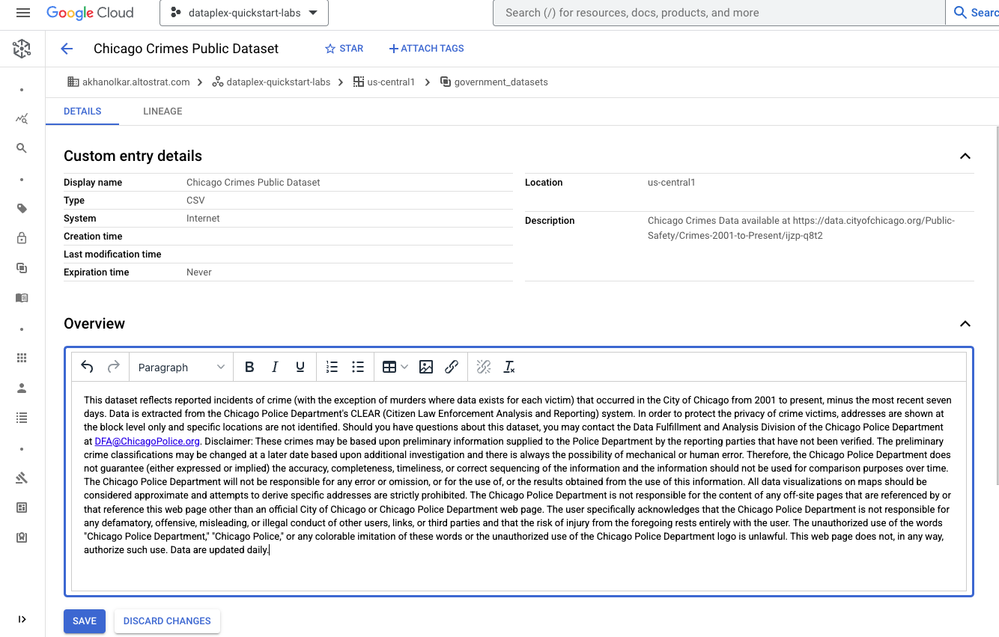   
<br><br>

   
<br><br>

<hr>

## 8. Add a URL to the custom Catalog entry overview

Add the text "Website" to the overview. The URL for website is-
```
https://data.cityofchicago.org/
```

Add the URL as shown below-

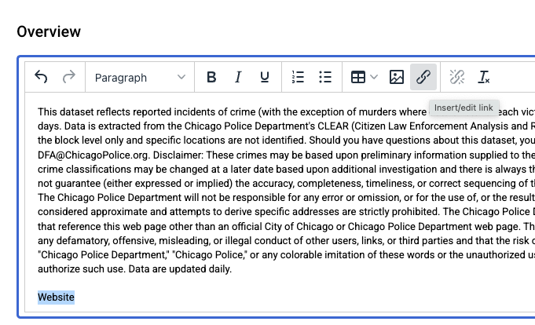   
<br><br>

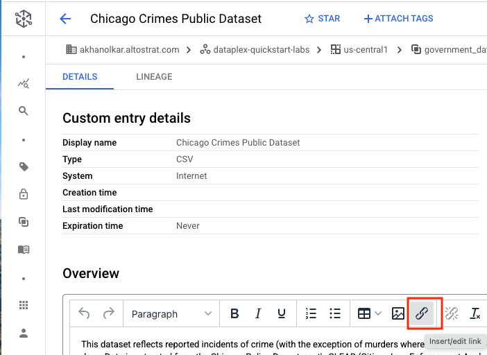   
<br><br>

   
<br><br>


## 9. Add an image or two for the custom Catalog entry

Next lets add an image to the overview as shown below. The author downloaded the image at the URL and added the same to the overview as shown below.

   
<br><br>


   
<br><br>


## 10. Final look

   
<br><br>

<hr>

## 9. Learn the tag search syntax


<hr>


<hr>
This concludes the lab module. You can proceed to the next module.
<hr>
