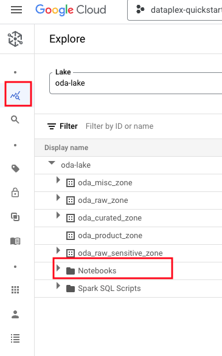

# M8-1: Dataplex Catalog basics

Dataplex Catalog enables users to discover, understand, observe and  manage ALL their data assets on Google Cloud.

It offers:
1. Simple and scalable metadat (keyword) Search capabilities for business and technical users
2. Real-time and batch synchronization of metadata and auto metadata ingestion for BigQuery  and Dataplex
3. Integrated auto tagging for sensitive data in BigQuery powered by Data Loss Protection (DLP)
4. Pre-built commonly used tag templates for tagging data assets
5. Unified and Integrated security with IAM to provide granular access controls for metadata access
6. Open APIs to enable read, write or search metadata with support for Python, Java, Go, Ruby, C# and PHP
  
In this lab module, we will review the Dataplex Catalog UI.

### Prerequisites

Successful completion of the prior modules

### Duration

~ 5 minutes or less

### Pictorial overview of lab

   
  

## Lab

### 1. Navigate to the Cloud Catalog
Navigate to the Dataplex UI -> Search as show below, in the Cloud Console. 

   
  

