# M8-2: Create an overview in Dataplex Catalog for a Catalog Entry

A Dataplex tag template is a metadata template for attributes you want to attach to an entry. You can use available tag templates or create a custom tag template based on your unique requirements and persist to Dataplex Catalog. You can then associate the same template with a Catalog entry - with values populated for the attributed you defined.

In this lab module, we will learn how to create create a tag tenplate and attach to the Chicago Crimes custom entry from the prior module.

### Prerequisites

Successful completion of prior modules

### Approximate duration

15 minutes or less to complete

<hr>

## 1. Lab

### 1.1. Create a Tag Template
Follow the steps below to create a Tag Template-

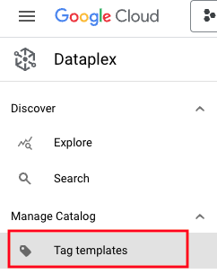   
<br><br>

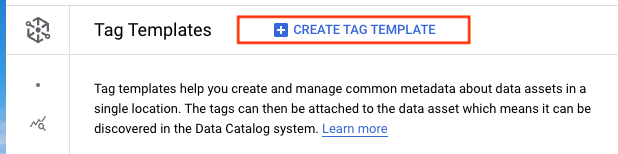   
<br><br>

   
<br><br>

   
<br><br>

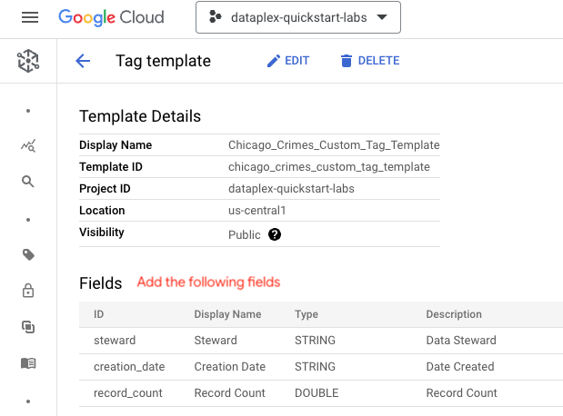   
<br><br>

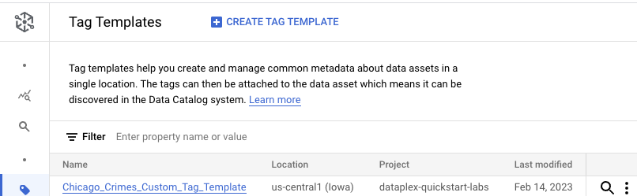   
<br><br>

<hr>

### 1.2. Associate the Tag Template to the custom Catalog entry

Associate the tag to the custom entry as shown below, and populate. Follow the steps in the screenshots in the exact order.

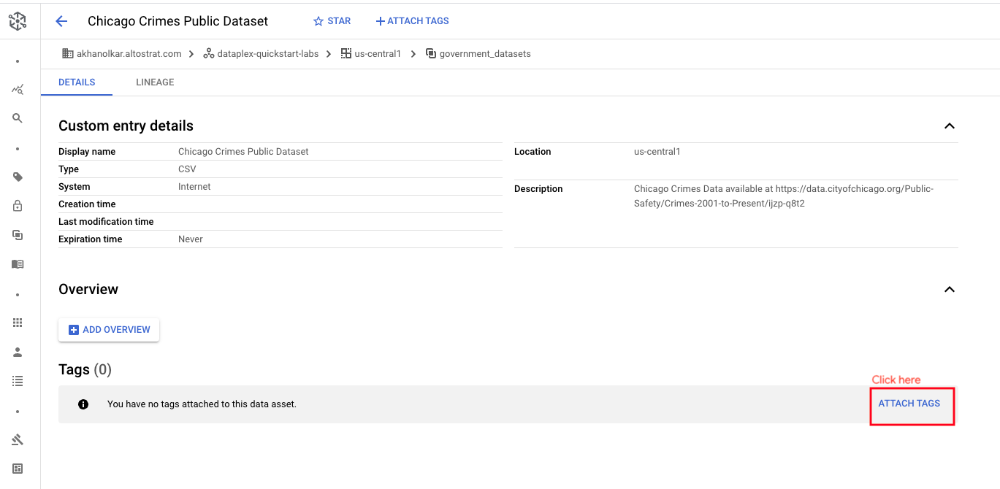   
<br><br>

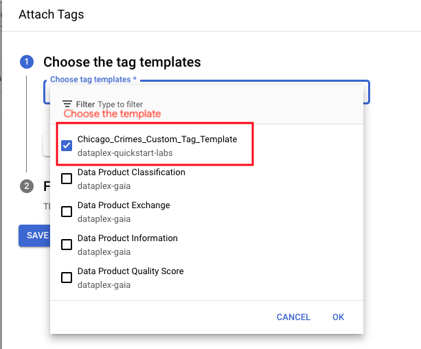   
<br><br>


   
<br><br>

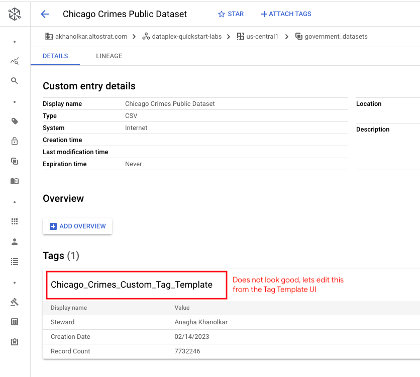   
<br><br>

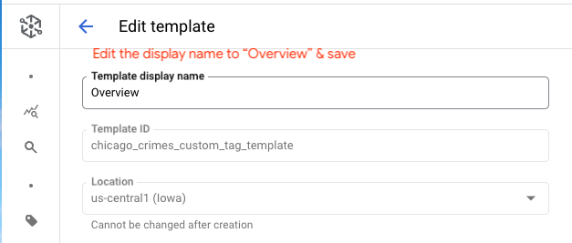   
<br><br>


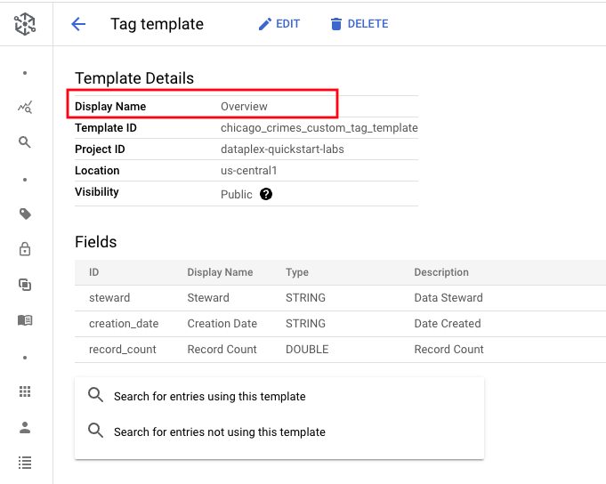   
<br><br>


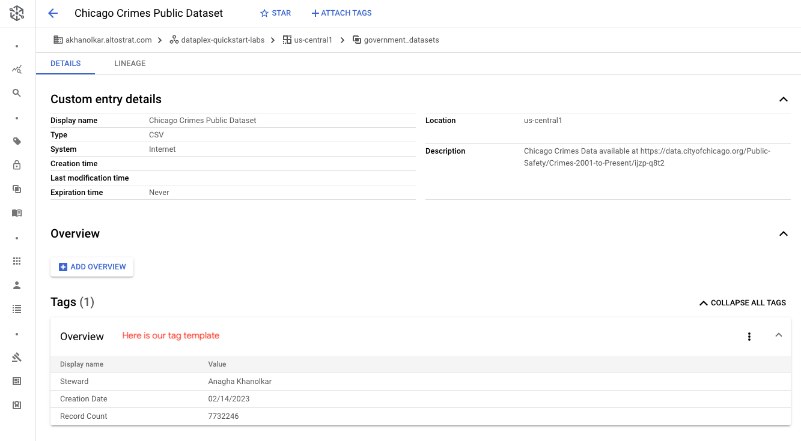   
<br><br>

<hr>

## 7. Add an overview of the dataset to the custom Catalog entry

Click on "Overview" and ass the following blurb & save-
```
This dataset reflects reported incidents of crime (with the exception of murders where data exists for each victim) that occurred in the City of Chicago from 2001 to present, minus the most recent seven days. Data is extracted from the Chicago Police Department's CLEAR (Citizen Law Enforcement Analysis and Reporting) system. In order to protect the privacy of crime victims, addresses are shown at the block level only and specific locations are not identified. Should you have questions about this dataset, you may contact the Data Fulfillment and Analysis Division of the Chicago Police Department at DFA@ChicagoPolice.org. Disclaimer: These crimes may be based upon preliminary information supplied to the Police Department by the reporting parties that have not been verified. The preliminary crime classifications may be changed at a later date based upon additional investigation and there is always the possibility of mechanical or human error. Therefore, the Chicago Police Department does not guarantee (either expressed or implied) the accuracy, completeness, timeliness, or correct sequencing of the information and the information should not be used for comparison purposes over time. The Chicago Police Department will not be responsible for any error or omission, or for the use of, or the results obtained from the use of this information. All data visualizations on maps should be considered approximate and attempts to derive specific addresses are strictly prohibited. The Chicago Police Department is not responsible for the content of any off-site pages that are referenced by or that reference this web page other than an official City of Chicago or Chicago Police Department web page. The user specifically acknowledges that the Chicago Police Department is not responsible for any defamatory, offensive, misleading, or illegal conduct of other users, links, or third parties and that the risk of injury from the foregoing rests entirely with the user. The unauthorized use of the words "Chicago Police Department," "Chicago Police," or any colorable imitation of these words or the unauthorized use of the Chicago Police Department logo is unlawful. This web page does not, in any way, authorize such use. Data are updated daily.

```

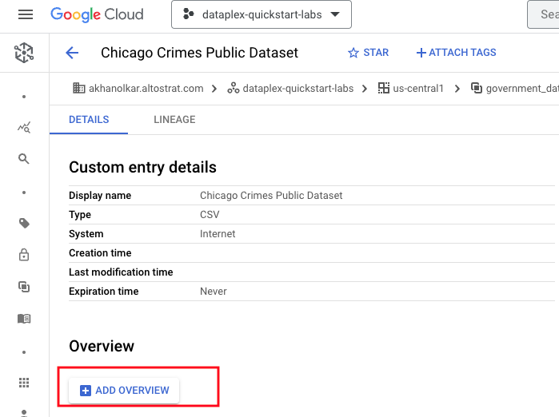   
<br><br>

   
<br><br>

   
<br><br>

<hr>

## 8. Add a URL to the custom Catalog entry overview

Add the text "Website" to the overview. The URL for website is-
```
https://data.cityofchicago.org/
```

Add the URL as shown below-

   
<br><br>

   
<br><br>

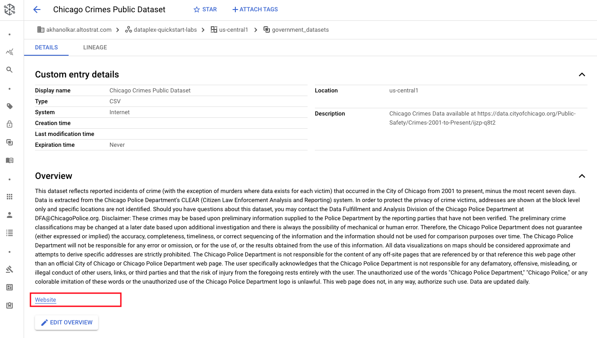   
<br><br>


## 9. Add an image or two for the custom Catalog entry

Next lets add an image to the overview as shown below. The author downloaded the image at the URL and added the same to the overview as shown below.

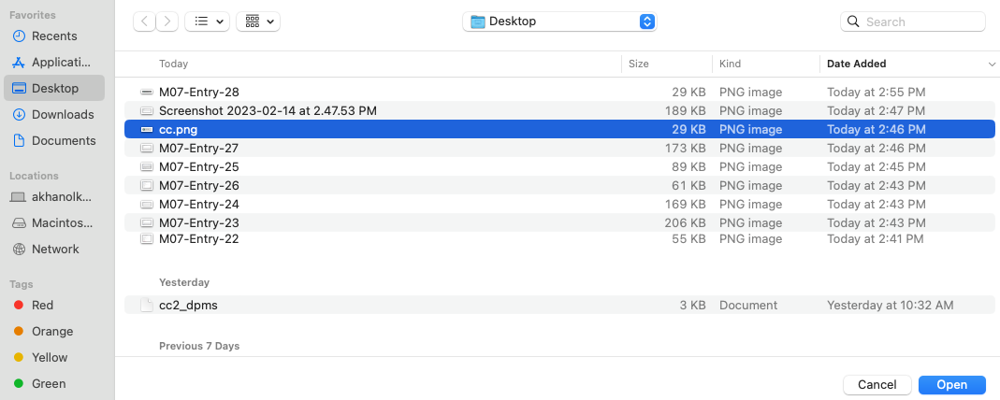   
<br><br>


   
<br><br>


## 10. Final look

   
<br><br>

<hr>

## 9. Learn the tag search syntax


<hr>


<hr>
This concludes the lab module. You can proceed to the next module.
<hr>
