# M9-2: Automated Data Lineage with Cloud Composer - BigQuery operators

This lab module covers data lineage with Cloud Composer, from a BigQuery context with a minimum viable data engineering pipeline. It takes 15 minutes or less to complete depending on your familiarity with Airflow, Cloud Composer and BigQuery.
<br>

### Documentation:

[Lineage Supported Systems](https://cloud.google.com/data-catalog/docs/concepts/about-data-lineage#lineage-supported-systems)<br>
[Lineage with Cloud Composer](https://cloud.google.com/composer/docs/composer-2/lineage-integration#about_data_lineage_integration)

### 1. What's involved in this lab module

In the prior module, we reviewed lineage with executing plain BigQuery SQL. In this lab module, we will demonstrate lineage capture off of an Airflow DAG composed of BigQuery actions.

We will first create and test the queries in BigQuery, and then use an Apache Airflow DAG on Cloud Composer to orchestrate the pipeline and observe the lineage captured by Dataplex. Note that the lineage shows up minutes after a process is run/an entity is created.

**Note:** <br>
At the time of authoring of this lab, lineage in Cloud Composer was in preview, and supported for specific versions of Cloud Composer 2.

### 2. The Data Engineering Pipeline - building blocks (BigQuery SQL)

#### 2.1. The DAG

We will create the following DAG-

| BQ SQL Step | What's involved | 
| -- | :--- |  
| Step 1 |  **Curate Chicago Crimes:**<br>Details: Augment raw Chicago Crimes with attributes that we will use for trending<br>Persist to: ODA Curated Zone | 
| Step 2a |  **Trend Report 1: Crimes by Year:**<br>Details: Generate report on crimes by year from the curated crimes<br>Persist to: ODA Consumption Zone| 
| Step 2b |  **Trend Report 2: Crimes by Month:**<br>Details: Generate report on crimes by month from the curated crimes<br>Persist to: ODA Consumption Zone| 
| Step 2c |  **Trend Report 3: Crimes by Day:**<br>Details: Generate report on crimes by day of week from the curated crimes<br>Persist to: ODA Consumption Zone| 
| Step 2d |  **Trend Report 4: Crimes by Hour:**<br>Details: Generate report on crimes by hour of day from the curated crimes<br>Persist to: ODA Consumption Zone| 

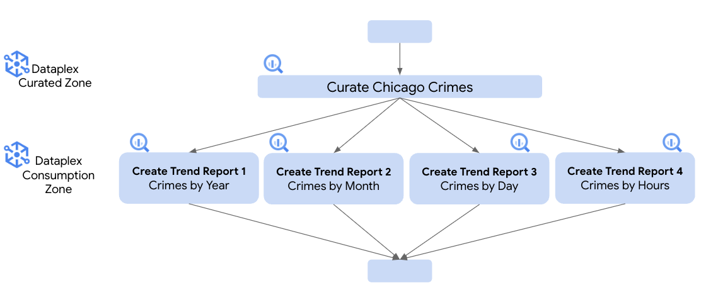   
<br><br>

#### 2.2. Just FYI - Source table: oda_raw_zone.chicago_crimes
This is purely informaional and repetative as it was already covered in the prior module.<br>

Recap: The table, oda_raw_zone.crimes_raw was populated from the BigQuery public dataset using this SQL below which you do not need to run:

<hr>


#### 2.3. Pipeline Step 1: Curate Chicago Crimes

The SQL for this is below. Do not run it, we will run from Airflow. This is identical to what we did in the prior module - but note the suffix of _cc2.

```
CREATE OR REPLACE TABLE
  oda_curated_zone.crimes_curated AS
SELECT
  *,
  CAST(year AS Integer) AS case_year,
  FORMAT_DATE('%B',date) AS case_month,
  FORMAT_DATE('%d',date) AS case_day_of_month,
  FORMAT_DATE('%k',date) AS case_hour,
  EXTRACT(DAYOFWEEK
  FROM
    date) AS case_day_of_week_nbr,
  FORMAT_DATE('%A',date) AS case_day_of_week_name
FROM
  oda_raw_zone.crimes_raw;
```

<hr>

#### 2.4. Pipeline Step 2a: Create Crimes Report by Year

The SQL for this is below. Do not run it, we will run from Airflow. This is identical to what we did in the prior module - but note the suffix of _cc2.

```
CREATE OR REPLACE TABLE
  oda_consumption_zone.crimes_by_year AS
SELECT
  case_year,
  COUNT(*) AS crime_count
FROM
  oda_curated_zone.crimes_curated
GROUP BY
  case_year;
```

<hr>

#### 2.5. Pipeline Step 2b: Create Crimes Report by Month 

The SQL for this is below. Do not run it, we will run from Airflow. This is identical to what we did in the prior module - but note the suffix of _cc2.

```
CREATE OR REPLACE TABLE
  oda_consumption_zone.crimes_by_month AS
SELECT
  case_month AS month,
  COUNT(*) AS crime_count
FROM
  oda_curated_zone.crimes_curated
GROUP BY
  case_month;
```

<hr>

#### 2.6. Pipeline Step 2c: Create Crimes Report by Day of Week

The SQL for this is below. Do not run it, we will run from Airflow. This is identical to what we did in the prior module - but note the suffix of _cc2.

```
CREATE OR REPLACE TABLE
  oda_consumption_zone.crimes_by_day AS
SELECT
  case_day_of_week_name AS day,
  COUNT(*) AS crime_count
FROM
  oda_curated_zone.crimes_curated
GROUP BY
  case_day_of_week_name;
```

<hr>

#### 2.7. Pipeline Step 2d: Create Crimes Report by Hour of Day

The SQL for this is below. Do not run it, we will run from Airflow. This is identical to what we did in the prior module - but note the suffix of _cc2.

```
CREATE OR REPLACE TABLE
  oda_consumption_zone.crimes_by_hour AS
SELECT
  case_hour AS hour_of_day,
  COUNT(*) AS crime_count
FROM
  oda_curated_zone.crimes_curated
GROUP BY
  case_hour;
```

<hr>


## 3. Enable Data Lineage in Cloud Composer & review the DAG code

### 3.1. Enable Data Lineage in Cloud Composer
The Terraform you ran in module 2 provisioned Cloud Composer. We will update it to enable lineage.<br>

Paste the below in Cloud Shell-
```
PROJECT_ID=`gcloud config list --format "value(core.project)" 2>/dev/null`
PROJECT_NBR=`gcloud projects describe $PROJECT_ID | grep projectNumber | cut -d':' -f2 |  tr -d "'" | xargs`
CC2_ENV_NM="oda-${PROJECT_NBR}-cc2"

gcloud composer environments update oda-36819656457-cc2 \
    --enable-cloud-data-lineage-integration
```

Alternately from the UI, as follows:

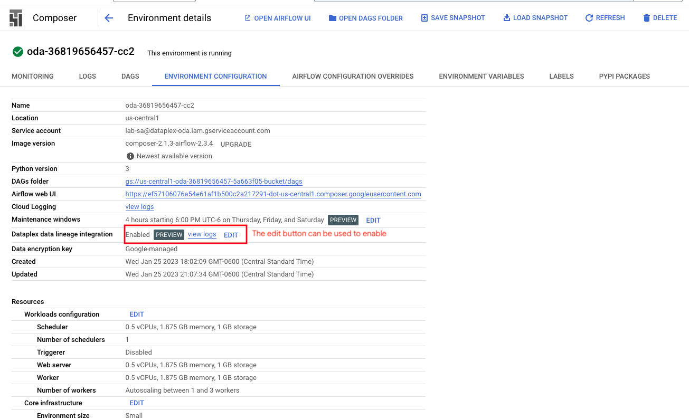   
<br><br>

### 3.2. Review the Airflow DAG Python script

[Full script](https://github.com/anagha-google/dataplex-oda/blob/main/00-resources/scripts/airflow/chicago-crimes-analytics/bq_lineage_pipeline.py)

```
from airflow import models
from airflow.operators import dummy_operator
from airflow.providers.google.cloud.operators import bigquery
from airflow.utils import trigger_rule
from datetime import datetime
from airflow.utils.dates import days_ago


PROJECT_ID = models.Variable.get('project_id')


CURATE_CHICAGO_CRIMES = f"""
CREATE OR REPLACE TABLE
  `{PROJECT_ID}.oda_curated_zone.crimes_curated` AS
SELECT
  *,
  CAST(year AS Integer) AS case_year,
  FORMAT_DATE('%B',date) AS case_month,
  FORMAT_DATE('%d',date) AS case_day_of_month,
  FORMAT_DATE('%k',date) AS case_hour,
  EXTRACT(DAYOFWEEK FROM date) AS case_day_of_week_nbr,
  FORMAT_DATE('%A',date) AS case_day_of_week_name
FROM
  oda_raw_zone.crimes_raw;
"""

TREND_BY_YEAR = f"""
CREATE OR REPLACE TABLE
  `{PROJECT_ID}.oda_consumption_zone.crimes_by_year` AS
SELECT
  case_year,
  COUNT(*) AS crime_count
FROM
  oda_curated_zone.crimes_curated
GROUP BY
  case_year;
"""

TREND_BY_MONTH = f"""
CREATE OR REPLACE TABLE
  `{PROJECT_ID}.oda_consumption_zone.crimes_by_month` AS
SELECT
  case_month AS month,
  COUNT(*) AS crime_count
FROM
  oda_curated_zone.crimes_curated
GROUP BY
  case_month;
"""


TREND_BY_DAY = f"""
CREATE OR REPLACE TABLE
  `{PROJECT_ID}.oda_consumption_zone.crimes_by_day` AS
SELECT
  case_day_of_week_name AS day,
  COUNT(*) AS crime_count
FROM
  oda_curated_zone.crimes_curated
GROUP BY
  case_day_of_week_name;
"""


TREND_BY_HOUR = f"""
CREATE OR REPLACE TABLE
  `{PROJECT_ID}.oda_consumption_zone.crimes_by_hour` AS
SELECT
  case_hour AS hour_of_day,
  COUNT(*) AS crime_count
FROM
  oda_curated_zone.crimes_curated
GROUP BY
  case_hour;
"""

with models.DAG(
        'Chicago_Crime_Trends_From_BQ_With_OOB_Lineage',
        schedule_interval=None,
        start_date = days_ago(2),
        catchup=False) as dag:

    start = dummy_operator.DummyOperator(
        task_id='start',
        trigger_rule='all_success'
    )

    end = dummy_operator.DummyOperator(
        task_id='end',
        trigger_rule='all_done'
    )

    curate_chicago_crimes = bigquery.BigQueryInsertJobOperator(
        task_id="Curate_Chicago_Crimes",
        configuration={
            "query": {
                "query": CURATE_CHICAGO_CRIMES,
                "useLegacySql": False
            }
        }
    )
    
    trend_by_year = bigquery.BigQueryInsertJobOperator(
        task_id="Trend_By_Year",
        configuration={
            "query": {
                "query": TREND_BY_YEAR,
                "useLegacySql": False
            }
        }
    )

    trend_by_month = bigquery.BigQueryInsertJobOperator(
        task_id="Trend_By_Month",
        configuration={
            "query": {
                "query": TREND_BY_MONTH,
                "useLegacySql": False
            }
        }
    )

    trend_by_day = bigquery.BigQueryInsertJobOperator(
        task_id="Trend_By_Day",
        configuration={
            "query": {
                "query": TREND_BY_DAY,
                "useLegacySql": False
            }
        }
    )
 
    trend_by_hour = bigquery.BigQueryInsertJobOperator(
        task_id="Trend_By_Hour",
        configuration={
            "query": {
                "query": TREND_BY_HOUR,
                "useLegacySql": False
            }
        }
    )
  
start >> curate_chicago_crimes >> [trend_by_year, trend_by_month, trend_by_day, trend_by_hour] >> end

```


<hr>

## 4. Run the Airflow DAG

### 4.1. Navigate to the Cloud Composer UI in the Cloud Console and launch the Airflow UI

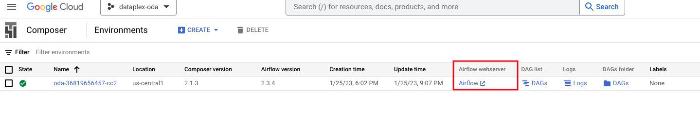   
<br><br>

### 4.2. Run the DAG "Chicago_Crime_Trends_BQ_SQL"

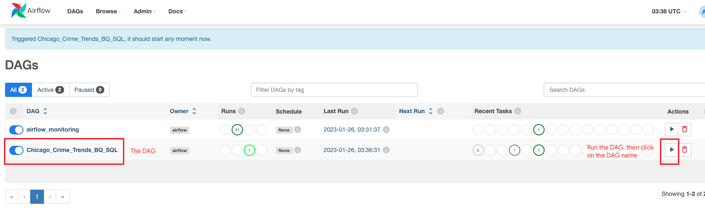   
<br><br>

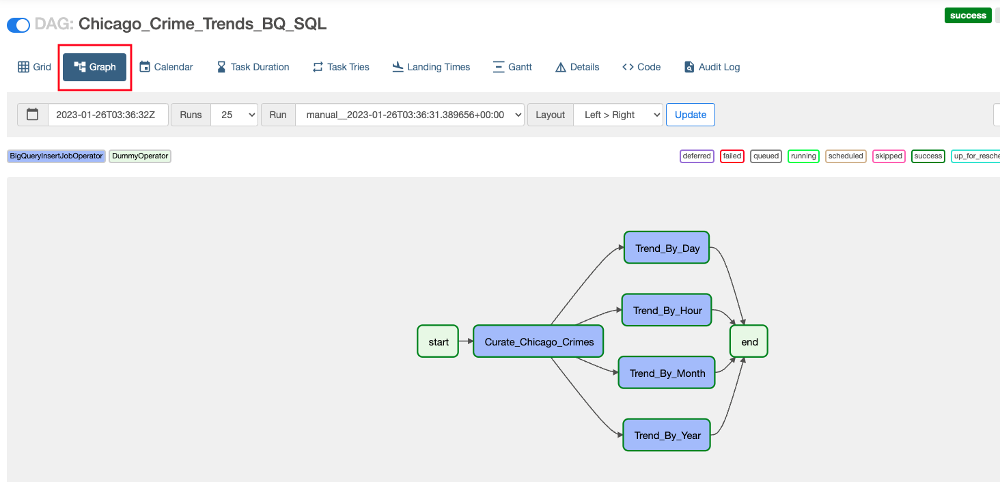   
<br><br>

### 4.3. Validate the creation of tables in BigQuery

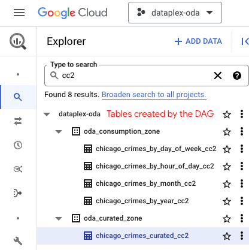   
<br><br>

<hr>

## 5. Review the lineage captured in Dataplex UI

In the BigQuery UI, click on the table, oda_curated_zone.chicago_crimes_curated_cc2 and open the table, click on lineage and review the same as shown below. 

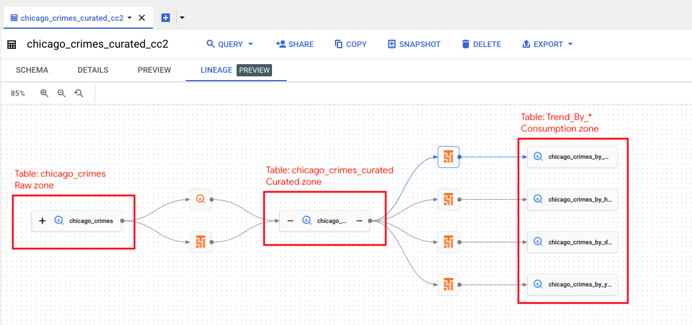   
<br><br>

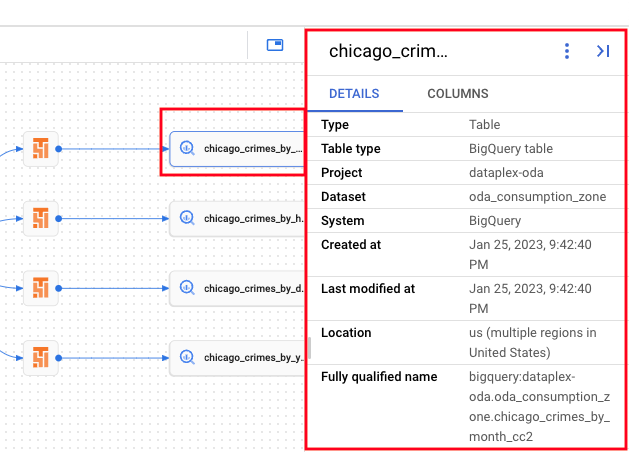   
<br><br>

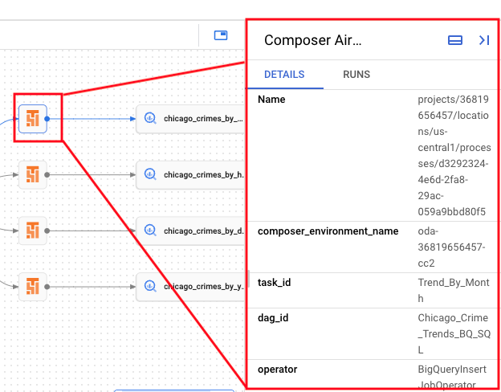   
<br><br>

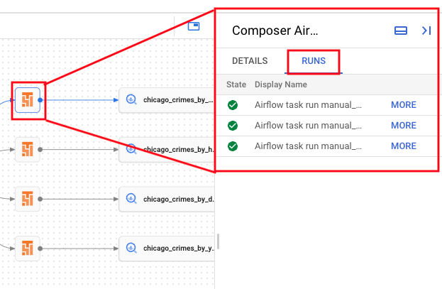   
<br><br>

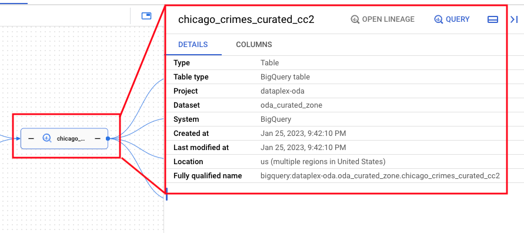   
<br><br>

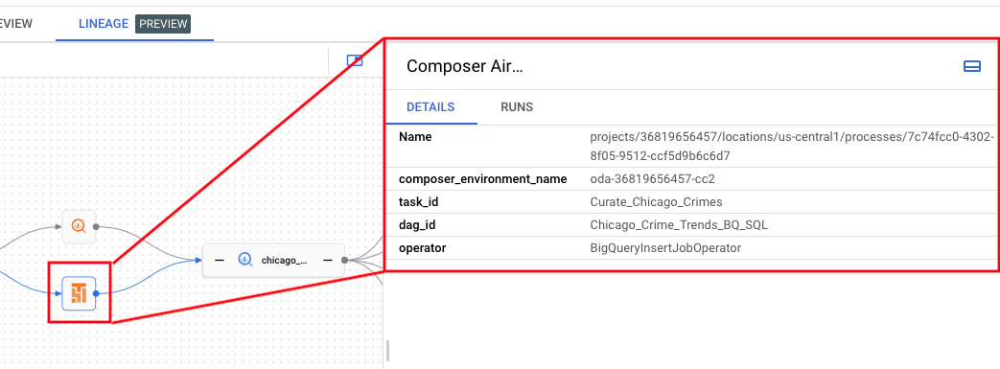   
<br><br>

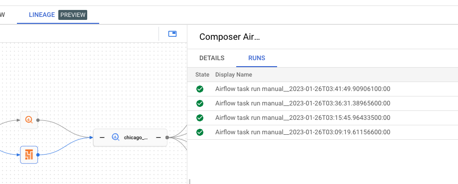   
<br><br>

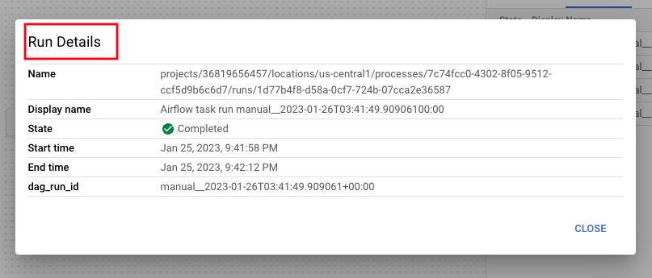   
<br><br>


<hr>
This concules the lab module. Proceed to the next module.
<hr>


