# M9-3: Lineage for Apache Spark pipelines orchestrated by Apache Airflow on Cloud Composer

In this lab module, we will repeat what we did with lineage of BigQuery based Airflow DAG, except, we will use Apache Spark on Dataproc Serverless instead. Note that Dataproc Serverless is not a natively supported service with Dataplex automated lineage capture. So, we will have use custom lineage feature in Cloud Composer.

### Prerequisites
Successful completion of prior lab modules

### Duration
~60 minutes

### Learning Units

[1. Concepts](module-08-data-lineage-with-bigquery.md#concepts-data-lineage-information-model) <br>
[2. Lab](module-08-data-lineage-with-bigquery.md#lab-automated-lineage-capture-for-bigquery-jobs)

### Solution Architecture

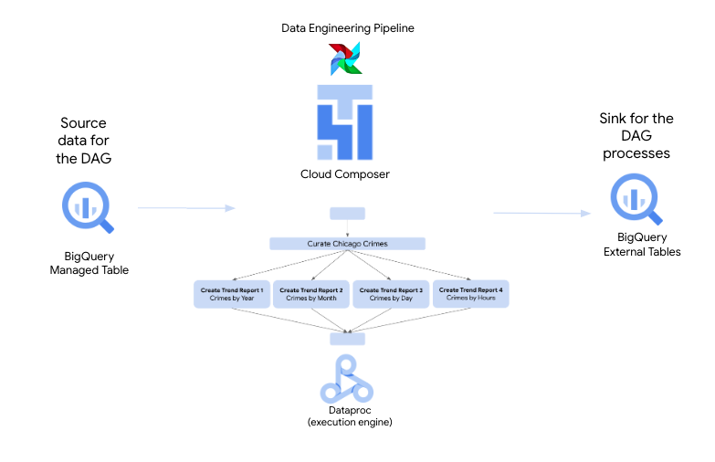   
<br><br>


### Pictorial overview of the lab module

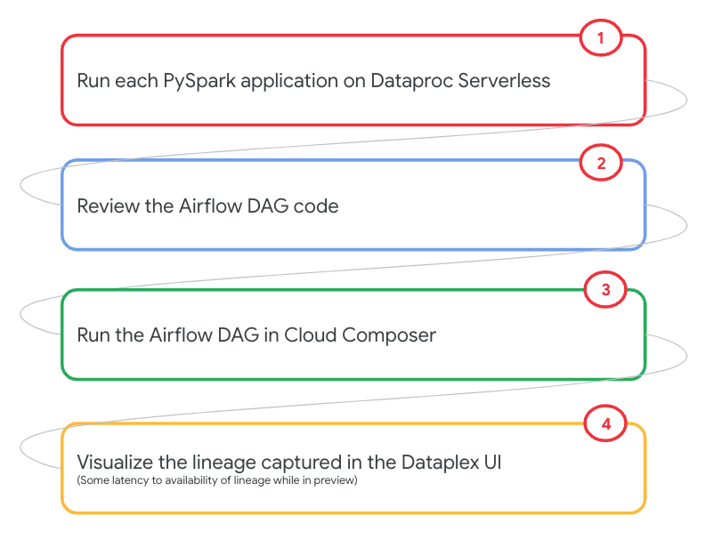   
<br><br>


### Learning goals

1. We will run pre-created PySpark scripts that curate Chicago crimes, and then generate Crime trend reports
2. Next, we will run a DAG to orchestrate the above, without custom lineage
3. Finally, we will run a DAG to orchestrate, with custom lineage

<hr>

## LAB

## 1. Lab - Run the PySpark scripts manually from CLI

### 1.1. Variables
Paste the below in Cloud Shell-
```
PROJECT_ID=`gcloud config list --format "value(core.project)" 2>/dev/null`
PROJECT_NBR=`gcloud projects describe $PROJECT_ID | grep projectNumber | cut -d':' -f2 |  tr -d "'" | xargs`
LOCATION="us-central1"
SUBNET_URI="projects/$PROJECT_ID/regions/$LOCATION/subnetworks/lab-snet"
UMSA_FQN="lab-sa@$PROJECT_ID.iam.gserviceaccount.com"
```

<hr>

### 1.2. Review the PySpark code and copy it to the raw code bucket

1. Review the code at the location below-
```
cd ~/dataplex-quickstart-labs/00-resources/scripts/pyspark/chicago-crimes-analytics/
```
Review the two PySpark scripts

<hr>

2. Copy the PySpark scripts from local to the code bucket (in case you modified anything) -
```
cd ~/dataplex-quickstart-labs/00-resources/scripts/pyspark/
gsutil cp chicago-crimes-analytics/* gs://raw-code-${PROJECT_NBR}/pyspark/chicago-crimes-analytics/
```

<hr>

### 1.3. Test each of the Spark jobs individually

#### 1.3.1. Curate Chicago Crimes 

In this section we will curate Chicago crimes with PySpark on Dataproc Serverless - we will dedupe, and augment the crimes data with some temporal attributes for trending.<br>

Run the command below to curate crimes with PySpark-
```
PIPELINE_ID=$RANDOM

gcloud dataproc batches submit pyspark gs://raw-code-${PROJECT_NBR}/pyspark/chicago-crimes-analytics/curate_crimes.py \
--project $PROJECT_ID \
--region $LOCATION  \
--batch chicago-crimes-curate-$PIPELINE_ID \
--subnet $SUBNET_URI \
--service-account $UMSA_FQN \
--metastore-service "projects/$PROJECT_ID/locations/$LOCATION/services/lab-dpms-$PROJECT_NBR" \
--version=1.1 \
-- --projectID=$PROJECT_ID --tableFQN="oda_curated_zone.crimes_curated_spark" --peristencePath="gs://curated-data-$PROJECT_NBR/crimes-curated-spark/" 
```

Visualize the execution in the Dataproc->Batches UI-

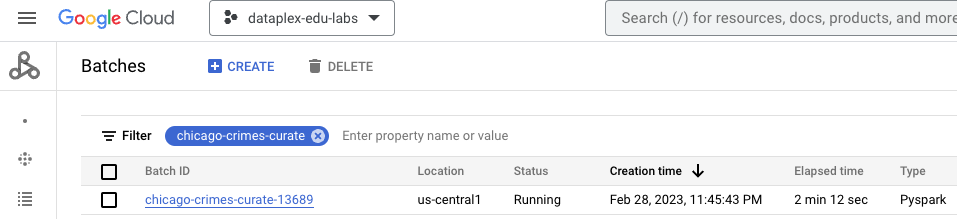   
<br><br>

<hr>

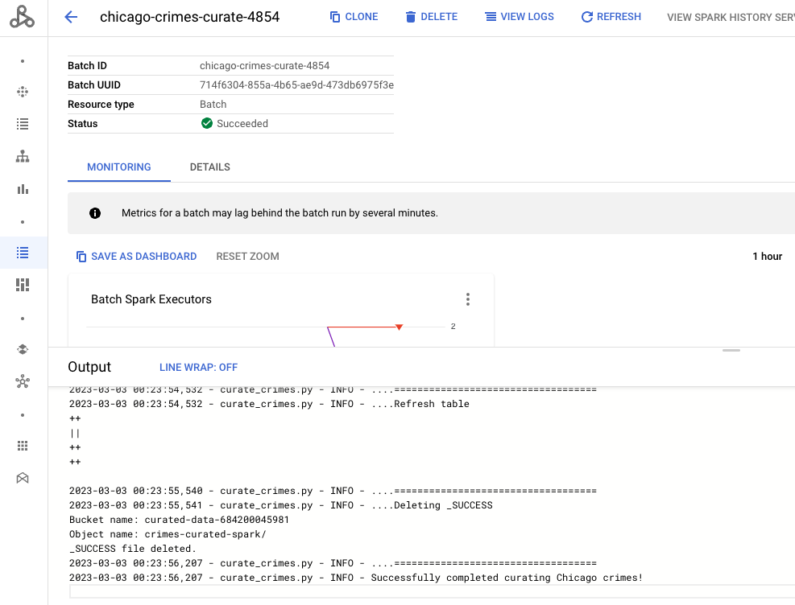   
<br><br>

<hr>

Navigate to the Cloud Storage to check for output files-

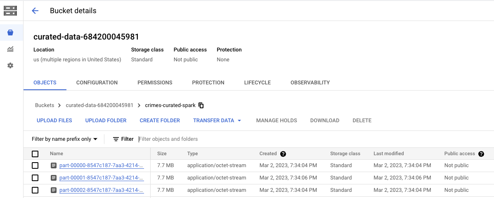   
<br><br>

<hr>

#### 1.3.2. Chicago Crimes by Year Report

Run the crimes_report.py script to generate the "Crimes by Year" report-
```
PIPELINE_ID=$RANDOM
baseName="crimes-by-year-spark"
dataprocServerlessSparkBatchID="$baseName-$PIPELINE_ID"
reportName='Chicago Crime Trend by Year'
reportDirGcsURI="gs://product-data-${PROJECT_NBR}/$baseName"
reportSQL='SELECT cast(case_year as int) case_year,count(*) AS crime_count FROM oda_curated_zone.crimes_curated_spark GROUP BY case_year;'
reportPartitionCount=1
reportTableFQN="oda_product_zone.crimes_by_year_spark"
reportTableDDL="CREATE TABLE IF NOT EXISTS ${reportTableFQN}(case_year int, crime_count long) STORED AS PARQUET LOCATION \"$reportDirGcsURI\""

gcloud dataproc batches submit pyspark gs://raw-code-${PROJECT_NBR}/pyspark/chicago-crimes-analytics/crimes_report.py \
--project $PROJECT_ID \
--region $LOCATION  \
--batch $dataprocServerlessSparkBatchID \
--subnet $SUBNET_URI \
--service-account $UMSA_FQN \
--metastore-service "projects/$PROJECT_ID/locations/$LOCATION/services/lab-dpms-$PROJECT_NBR" \
--version=1.1 \
-- --projectNbr=$PROJECT_NBR --projectID=$PROJECT_ID --reportDirGcsURI="$reportDirGcsURI" --reportName="$reportName" --reportSQL="$reportSQL" --reportPartitionCount=$reportPartitionCount --reportTableFQN="$reportTableFQN" --reportTableDDL="$reportTableDDL"
```

Visualize the execution in the Dataproc->Batches UI-

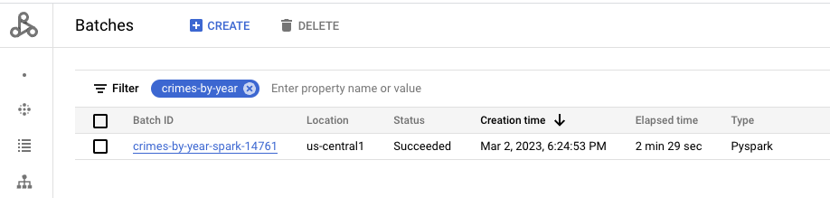   
<br><br>

<hr>

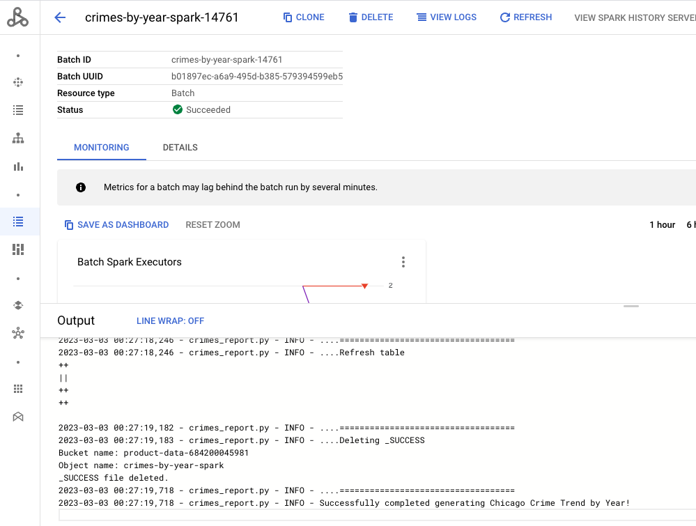   
<br><br>

<hr>

Navigate to the Cloud Storage to check for output files-

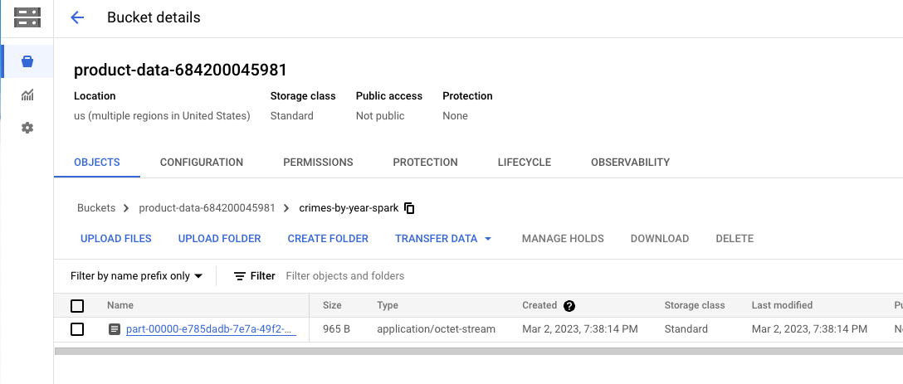   
<br><br>

<hr>


#### 1.3.3. Chicago Crimes by Month Report

Run the crimes_report.py script to generate the "Crimes by Month" report-
```
PIPELINE_ID=$RANDOM
baseName="crimes-by-month-spark"
dataprocServerlessSparkBatchID="$baseName-$PIPELINE_ID"
reportName='Chicago Crime Trend by Month'
reportDirGcsURI="gs://product-data-${PROJECT_NBR}/$baseName"
reportSQL='SELECT case_month,count(*) AS crime_count FROM oda_curated_zone.crimes_curated_spark GROUP BY case_month;'
reportPartitionCount=1
reportTableFQN="oda_product_zone.crimes_by_month_spark"
reportTableDDL="CREATE TABLE IF NOT EXISTS ${reportTableFQN}(case_month string, crime_count long) STORED AS PARQUET LOCATION \"$reportDirGcsURI\""

gcloud dataproc batches submit pyspark gs://raw-code-${PROJECT_NBR}/pyspark/chicago-crimes-analytics/crimes_report.py \
--project $PROJECT_ID \
--region $LOCATION  \
--batch $dataprocServerlessSparkBatchID \
--subnet $SUBNET_URI \
--service-account $UMSA_FQN \
--metastore-service "projects/$PROJECT_ID/locations/$LOCATION/services/lab-dpms-$PROJECT_NBR" \
--version=1.1 \
-- --projectNbr=$PROJECT_NBR --projectID=$PROJECT_ID --reportDirGcsURI="$reportDirGcsURI" --reportName="$reportName" --reportSQL="$reportSQL" --reportPartitionCount=$reportPartitionCount --reportTableFQN="$reportTableFQN" --reportTableDDL="$reportTableDDL"
```

Visualize the execution in the Dataproc->Batches UI-

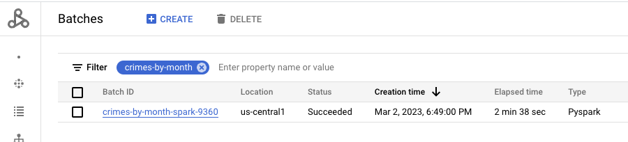   
<br><br>

<hr>

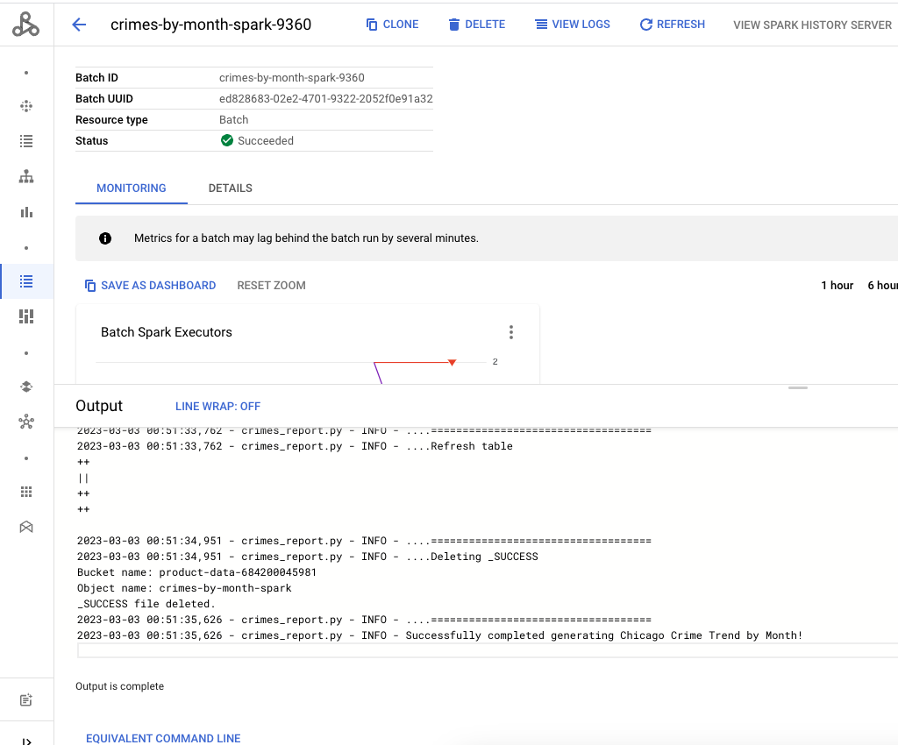   
<br><br>

<hr>

Navigate to the Cloud Storage to check for output files-

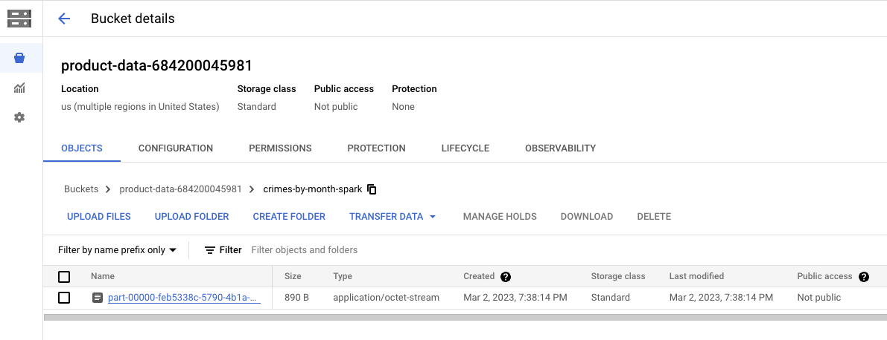   
<br><br>

<hr>

#### 1.3.4. Chicago Crimes by Day of Week Report

Run the crimes_report.py script to generate the "Crimes by Day" report-
```
PIPELINE_ID=$RANDOM
baseName="crimes-by-day-spark"
dataprocServerlessSparkBatchID="$baseName-$PIPELINE_ID"
reportName='Chicago Crime Trend by Day'
reportDirGcsURI="gs://product-data-${PROJECT_NBR}/$baseName"
reportSQL='SELECT case_day_of_week,count(*) AS crime_count FROM oda_curated_zone.crimes_curated_spark GROUP BY case_day_of_week;'
reportPartitionCount=1
reportTableFQN="oda_product_zone.crimes_by_day_spark"
reportTableDDL="CREATE TABLE IF NOT EXISTS ${reportTableFQN}(case_day_of_week string, crime_count long) STORED AS PARQUET LOCATION \"$reportDirGcsURI\""

gcloud dataproc batches submit pyspark gs://raw-code-${PROJECT_NBR}/pyspark/chicago-crimes-analytics/crimes_report.py \
--project $PROJECT_ID \
--region $LOCATION  \
--batch $dataprocServerlessSparkBatchID \
--subnet $SUBNET_URI \
--service-account $UMSA_FQN \
--metastore-service "projects/$PROJECT_ID/locations/$LOCATION/services/lab-dpms-$PROJECT_NBR" \
--version=1.1 \
-- --projectNbr=$PROJECT_NBR --projectID=$PROJECT_ID --reportDirGcsURI="$reportDirGcsURI" --reportName="$reportName" --reportSQL="$reportSQL" --reportPartitionCount=$reportPartitionCount --reportTableFQN="$reportTableFQN" --reportTableDDL="$reportTableDDL"
```

Visualize the execution in the Dataproc->Batches UI-

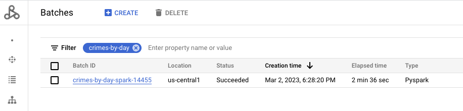   
<br><br>

<hr>

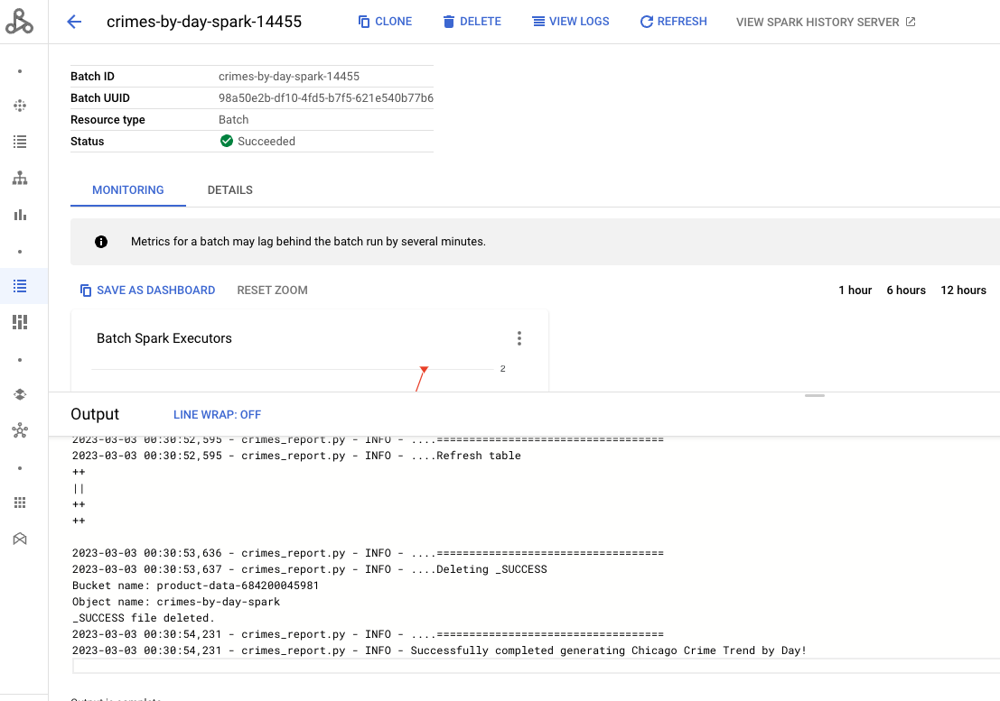   
<br><br>

<hr>

Navigate to the Cloud Storage to check for output files-

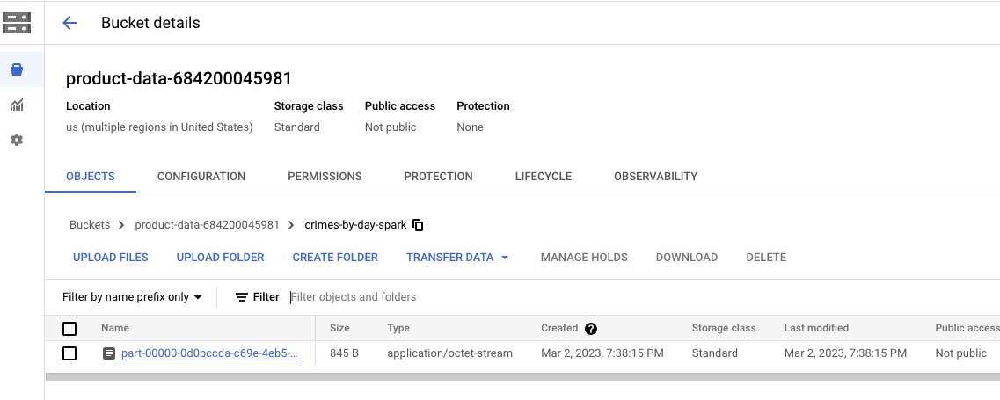   
<br><br>

<hr>

## 1.3.5. Chicago Crimes by Hour of Day Report

```
PIPELINE_ID=$RANDOM
baseName="crimes-by-hour-spark"
dataprocServerlessSparkBatchID="$baseName-$PIPELINE_ID"
reportName='Chicago Crime Trend by Hour'
reportDirGcsURI="gs://product-data-${PROJECT_NBR}/$baseName"
reportSQL='SELECT CAST(case_hour_of_day AS int) case_hour_of_day,count(*) AS crime_count FROM oda_curated_zone.crimes_curated_spark GROUP BY case_hour_of_day;'
reportPartitionCount=1
reportTableFQN="oda_product_zone.crimes_by_hour_spark"
reportTableDDL="CREATE TABLE IF NOT EXISTS ${reportTableFQN}(case_hour_of_day int, crime_count long) STORED AS PARQUET LOCATION \"$reportDirGcsURI\""


gcloud dataproc batches submit pyspark gs://raw-code-${PROJECT_NBR}/pyspark/chicago-crimes-analytics/crimes_report.py \
--project $PROJECT_ID \
--region $LOCATION  \
--batch $dataprocServerlessSparkBatchID \
--subnet $SUBNET_URI \
--service-account $UMSA_FQN \
--metastore-service "projects/$PROJECT_ID/locations/$LOCATION/services/lab-dpms-$PROJECT_NBR" \
--version=1.1 \
-- --projectNbr=$PROJECT_NBR --projectID=$PROJECT_ID --reportDirGcsURI="$reportDirGcsURI" --reportName="$reportName" --reportSQL="$reportSQL" --reportPartitionCount=$reportPartitionCount --reportTableFQN="$reportTableFQN" --reportTableDDL="$reportTableDDL"
```

Visualize the execution in the Dataproc->Batches UI-

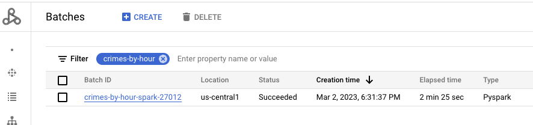   
<br><br>

<hr>

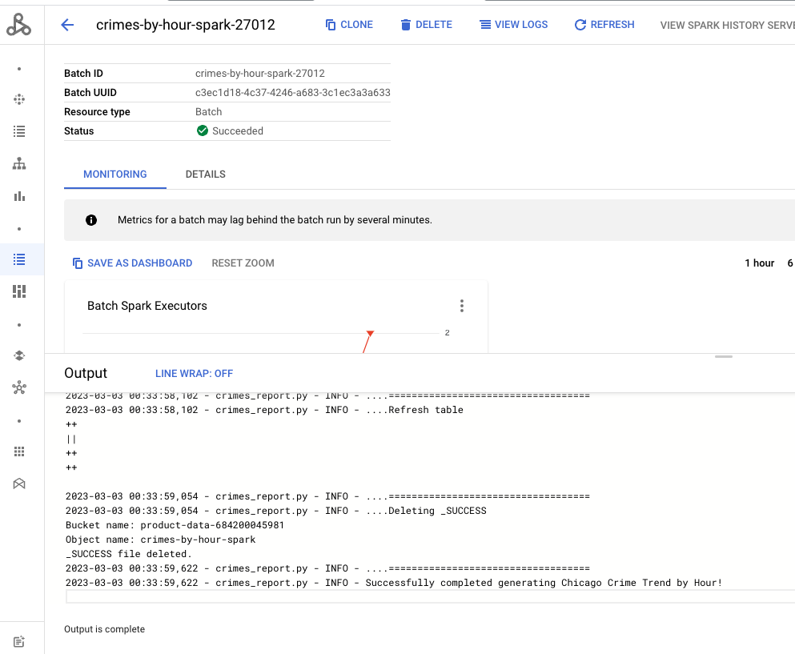   
<br><br>

<hr>

Navigate to the Cloud Storage to check for output files-

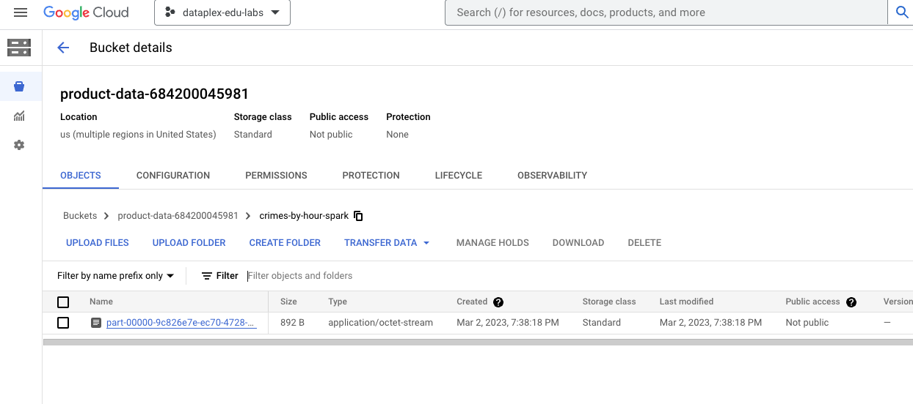   
<br><br>

<hr>
<hr>


## 2. The Airflow DAG WITH custom lineage - run on Cloud Composer
