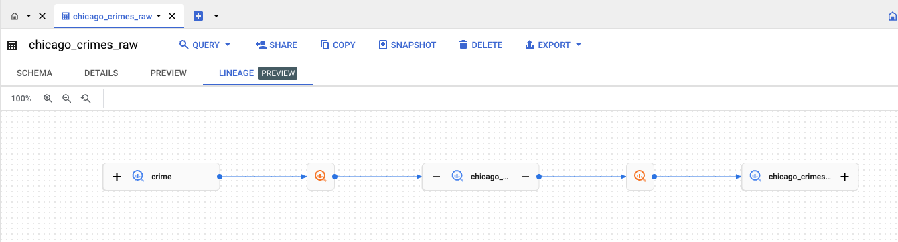
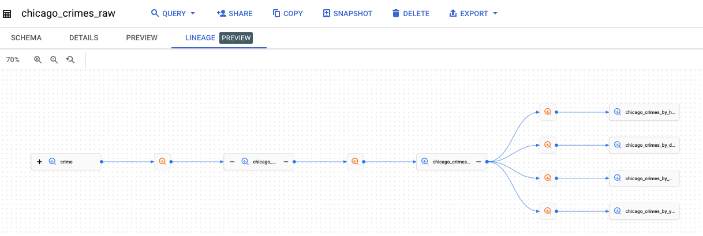
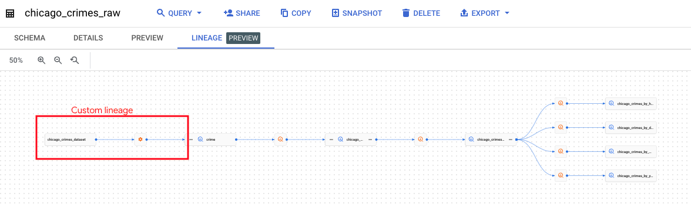
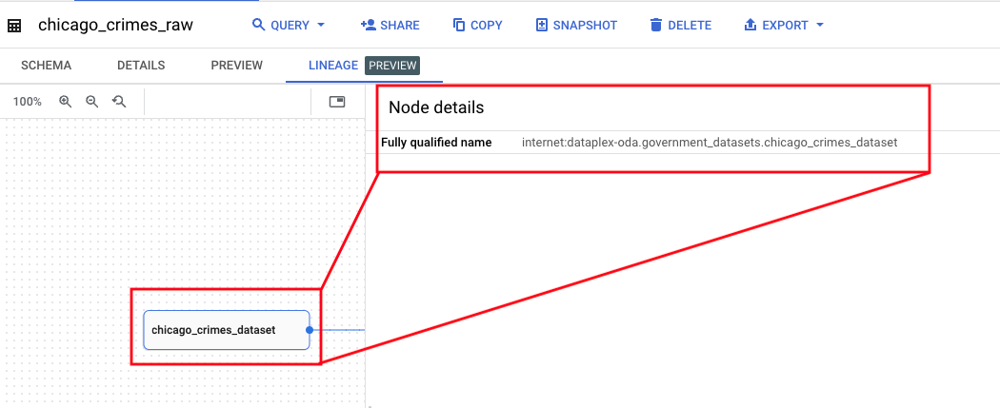
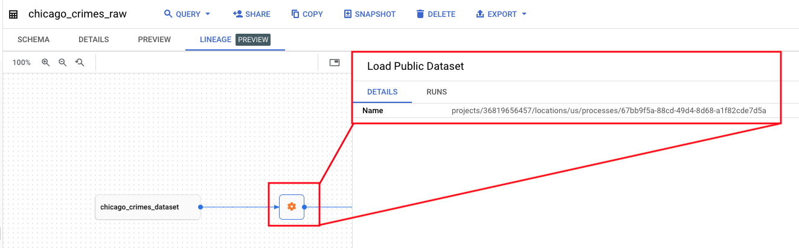
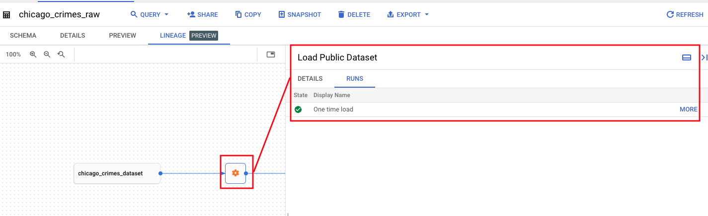
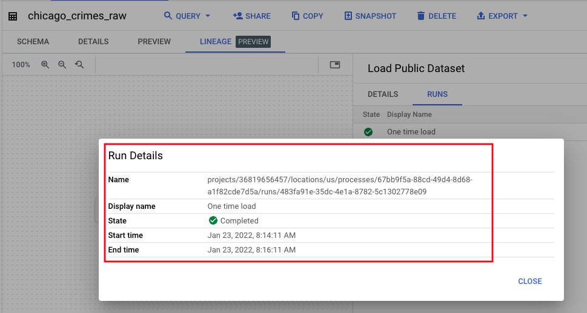
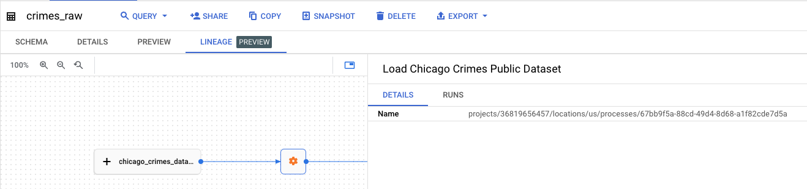

# M9-4: Custom Lineage with Custom Catalog Entry

In this lab module, we will use the Dataplex Lineage API and make a custom lineage entry for the custom entry we created for Chicago Crimes Dataset that is part of the custom entry group we created called "Government Datasets", for a custom process we will create called "Load Public Dataset" to the bigquery public dataset table called "crime" from which we sourced data in module 3.

**Prerequisite:**<br>
1. [Lab module on creating custom entries in Dataplex Catalog](../module-07-1-custom-entry-in-catalog.md)<br>
2. [Lab module on native support for lineage with BQ SQL]()

## Learning Goal 1: Custom lineage creation with Dataplex Lineage API
| # | Unit | 
| -- | :--- | 
| 1 | Create custom process |
| 2 | Create custom run for the custom process |
| 3 | Create custom lineage event for the custom run |

## Learning Goal 2: Learning units - custom lineage management with Dataplex Lineage API:
| # | Unit | 
| -- | :--- | 
| 4 | Delete custom lineage event created in #3 |
| 5 | Delete custom run for the custom process |
| 6 | Delete custom process |

## Learning Goal 3: Learning units - custom metadata management with Dataplex Metadata API:
| # | Unit | 
| -- | :--- | 
| 7 | Delete custom entry |
| 8 | Delete custom entry group |

<hr>

## 1. Variables

Paste the below in cloud shell-
```
PROJECT_ID=`gcloud config list --format "value(core.project)" 2>/dev/null`
PROJECT_NBR=`gcloud projects describe $PROJECT_ID | grep projectNumber | cut -d':' -f2 |  tr -d "'" | xargs`
LOCATION_MULTI="us"
LOCATION="us-central1"
```

<hr>

## 2. Lineage Process 

We will learn to create a process and list the same using the Lineage API.

### 2.1. Create a process

We first need to create a process. Lets create a fictitious process called "Load Public Dataset". Paste the below in cloud shell-

```
curl -X POST -H "Authorization: Bearer $(gcloud auth print-access-token)" \
-H "Content-Type: application.json" \
https://us-datalineage.googleapis.com/v1/projects/$PROJECT_ID/locations/$LOCATION_MULTI/processes \
-d "{\
  \"displayName\": \"Load Public Dataset\" \
}"
```

### 2.2. List processes

Paste the below in cloud shell, to list the processes-
```

rm -rf lineage_processes_listing.json

curl -H "Authorization: Bearer $(gcloud auth print-access-token)" \
-H "Content-Type: application.json" \
https://us-datalineage.googleapis.com/v1/projects/$PROJECT_ID/locations/$LOCATION_MULTI/processes >> lineage_processes_listing.json
```

The process we created has the keyword "Public", lets zone in:
```
cat lineage_processes_listing.json | grep -C 1 Public
```

Author's output:
```
THIS IS INFORMATIONAL
  {
      "name": "projects/36819656457/locations/us/processes/5b873430-5ebf-40e6-b116-4662fd3e9244",
      "displayName": "Load Public Dataset"
    },
 ```
 
### 2.3. Capture the process ID
We will need in subsequent steps:
```
CUSTOM_LINEAGE_PROCESS_ID=`cat lineage_processes_listing.json | grep -C 1 Public | grep name | cut -d'/' -f6 | tr -d \" | tr -d ,`
echo $CUSTOM_LINEAGE_PROCESS_ID
```

Author's process sample:
```
67bb9f5a-88cd-49d4-8d68-a1f82cde7d5a
```
<hr>

## 3. Lineage Process Run 

We will create an execution instance of the "Load Public Dataset" process we created, and refer to it as a "run". 

### 3.1. Create a run for the custom lineage process 

Paste the below in cloud shell-
```
curl -X POST -H "Authorization: Bearer $(gcloud auth print-access-token)" \
-H "Content-Type: application.json" \
https://us-datalineage.googleapis.com/v1/projects/$PROJECT_ID/locations/$LOCATION_MULTI/processes/$CUSTOM_LINEAGE_PROCESS_ID/runs -d "{\
  \"displayName\": \"One time load\", \
  \"startTime\": \"2022-01-23T14:14:11.238Z\", \
  \"endTime\": \"2022-01-23T14:16:11.238Z\", \
  \"state\": \"COMPLETED\" \
}"

```

### 3.2. List the custom lineage process run

Paste the below in cloud shell-
```
rm -rf custom_lineage_run.json

curl -H "Authorization: Bearer $(gcloud auth print-access-token)" \
-H "Content-Type: application.json" \
https://us-datalineage.googleapis.com/v1/projects/$PROJECT_ID/locations/$LOCATION_MULTI/processes/$CUSTOM_LINEAGE_PROCESS_ID/runs >> custom_lineage_run.json
```

Author's output:
```
THIS IS INFORMATIONAL if you run the below-

cat custom_lineage_run.json

Output:
{
  "runs": [
    {
      "name": "projects/36819656457/locations/us/processes/5b873430-5ebf-40e6-b116-4662fd3e9244/runs/12e846d1-e7de-4767-a6a3-dc124b02acbe",
      "displayName": "One time load",
      "startTime": "2022-01-23T14:14:11.238Z",
      "endTime": "2022-01-23T14:16:11.238Z",
      "state": "COMPLETED"
    }
  ]
}
```

### 3.3. Capture the run ID of the custom lineage process run we created

Paste the below in cloud shell-
```
CUSTOM_LINEAGE_PROCESS_RUN_ID=`cat custom_lineage_run.json | grep name | grep / | cut -d'/' -f8 | tr -d \" | tr -d ,`
```

<hr>

## 4. Lineage Event

In this section, we will create a lineage event.

### 4.1. Create a custom lineage event for the process run we created

Paste the below in cloud shell-

```
curl -X POST -H "Authorization: Bearer $(gcloud auth print-access-token)" \
-H "Content-Type: application.json" \
https://us-datalineage.googleapis.com/v1/projects/$PROJECT_ID/locations/$LOCATION_MULTI/processes/$CUSTOM_LINEAGE_PROCESS_ID/runs/$CUSTOM_LINEAGE_PROCESS_RUN_ID/lineageEvents -d "{\
  \"links\": [ \
    { \
      \"source\": { \
        \"fullyQualifiedName\":\"internet:$PROJECT_ID.government_datasets.chicago_crimes_dataset\" \
      }, \
      \"target\": { \
        \"fullyQualifiedName\":\"bigquery:bigquery-public-data.chicago_crime.crime\" \
      }, \
    } \
  ], \
  \"startTime\": \"2022-01-01T14:14:11.238Z\", \
}"

```

Author's output:
```
This is informational-
{     
  "name": "projects/36819656457/locations/us/processes/5b873430-5ebf-40e6-b116-4662fd3e9244/runs/12e846d1-e7de-4767-a6a3-dc124b02acbe/lineageEvents/c0ee925a-b1ad-408f-8820-0842e1c1f79f",
  "startTime": "2022-01-01T14:14:11.238Z",
  "links":i[e\": \"2022-01-01T14:14:11.238Z\", \
}"  {
      "source": {
        "fullyQualifiedName": "internet:dataplex-oda.government_datasets.chicago_crimes_dataset"
      },
      "target": {
        "fullyQualifiedName": "bigquery:dataplex-oda.oda_raw_zone.crimes_raw"
      }
    }
  ]
}
```

<hr>

### 4.2. List the lineage events


Paste the below in cloud shell-
```
rm -rf custom_lineage_events.json

curl -H "Authorization: Bearer $(gcloud auth print-access-token)" \
-H "Content-Type: application.json" \
https://us-datalineage.googleapis.com/v1/projects/$PROJECT_ID/locations/$LOCATION_MULTI/processes/$CUSTOM_LINEAGE_PROCESS_ID/runs/$CUSTOM_LINEAGE_PROCESS_RUN_ID/lineageEvents >> custom_lineage_events.json

```

Author's output:
```
This is informational output of reading custom_lineage_events.json-
{
  "name": "projects/36819656457/locations/us/processes/5b873430-5ebf-40e6-b116-4662fd3e9244/runs/12e846d1-e7de-4767-a6a3-dc124b02acbe/lineageEvents/7f30433e-e004-4a9f-b5b0-22f6e7bdfbc6",
  "startTime": "2022-01-01T14:14:11.238Z",
  "links": [
    {
      "source": {
        "fullyQualifiedName": "internet:dataplex-oda.government_datasets.chicago_crimes_dataset"
      },
      "target": {
        "fullyQualifiedName": "bigquery:dataplex-oda.oda_raw_zone.crimes_raw"
      }
    }
  ]
}

```

Capture the lineage event ID:

```
CUSTOM_LINEAGE_EVENT_ID=`cat custom_lineage_events.json | grep name | cut -d':' -f2 | cut -d '/' -f10 | tr -d \" | tr -d , `
```

<hr>

## 5. Lineage UI walkthrough

Lets navigate to the entity oda_raw_zone.crimes_raw in the Dataplex Search UI and click through to see the lineage as shown below. At the very upstream of the graph is the custom lineage entry. Note that it has an extra upstream entity, also called "crimes_raw". We will delete the same in the next step.

   
<br><br>

   
<br><br>

   
<br><br>

   
<br><br>

   
<br><br>

   
<br><br>

   
<br><br>

<hr>

## 7. Lineage REST Reference

https://cloud.google.com/data-catalog/docs/reference/data-lineage/rest

<br><br>

<hr>

## 8. Managing Lineage with the Lineage REST API

Lets declare variables:
```
PROJECT_ID=`gcloud config list --format "value(core.project)" 2>/dev/null`
PROJECT_NBR=`gcloud projects describe $PROJECT_ID | grep projectNumber | cut -d':' -f2 |  tr -d "'" | xargs`
LOCATION_MULTI="us"
LOCATION="us-central1"
```

### 8.1. Managing Lineage Processes

Lineage API supports the following when it comes to lineage processes:<br>
1. Create a process
2. List processes
3. Get specific process
4. Update a process name
5. Delete a process

You need to provide the process ID for lineage management.

#### 8.1.1. List Lineage Processes

Lets write all the processes to a file
```
rm -rf my_lineage_processes.json

curl -H "Authorization: Bearer $(gcloud auth print-access-token)" -H "Content-Type: application.json" https://us-datalineage.googleapis.com/v1/projects/$PROJECT_ID/locations/$LOCATION_MULTI/processes >> my_lineage_processes.json
```


#### 8.1.2. Find the specific process you created

Lets find the custom process we created
```
cat my_lineage_processes.json  | grep -C 1 "Load Public Dataset"
```


Author's output:
```
THIS IS INFORMATIONAL
      "name": "projects/36819656457/locations/us/processes/67bb9f5a-88cd-49d4-8d68-a1f82cde7d5a",
      "displayName": "Load Public Dataset"
    },
```

#### 8.1.3 Capture the custom process's ID

First lets try to display the process ID:
```
cat my_lineage_processes.json  | grep -C 1 "Load Public Dataset" | grep name | cut -d':' -f2 | cut -d '/' -f6
```

Lets assign it to a variable-
```
MY_CUSTOM_PROCESS_ID=`cat my_lineage_processes.json  | grep -C 1 "Load Public Dataset" | grep name | cut -d':' -f2 | cut -d '/' -f6 | tr -d \" | tr -d , `
echo $MY_CUSTOM_PROCESS_ID
```

You should see a GUID.

#### 8.1.4. Update the custom process name

The current process name is "Load Public Dataset". Lets update it to - "Load Chicago Crimes Public Dataset".

```
curl -X PATCH -H "Authorization: Bearer $(gcloud auth print-access-token)" -H "Content-Type: application.json" https://us-datalineage.googleapis.com/v1/projects/$PROJECT_ID/locations/$LOCATION_MULTI/processes/$MY_CUSTOM_PROCESS_ID -d "{ \
    \"displayName\": \"Load Chicago Crimes Public Dataset\" \
}"

```

   
<br><br>

<hr>

### 8.2. Managing Lineage Process Runs

Lineage API supports the following when it comes to lineage process runs:<br>
1. Create a process run
2. List process runs
3. Get specific process run
4. Update a process run name
5. Delete a process run

You need to provide the process run ID for lineage event association.

#### 8.2.1. List runs

Lets write all the lineage events for the process above to a file
```
rm -rf my_lineage_process_runs.json

curl -H "Authorization: Bearer $(gcloud auth print-access-token)" -H "Content-Type: application.json" https://us-datalineage.googleapis.com/v1/projects/$PROJECT_ID/locations/$LOCATION_MULTI/processes/$MY_CUSTOM_PROCESS_ID/runs >> my_lineage_process_runs.json
```


#### 8.2.2. Review the process run listing

Lets find the custom process run we created with grep; In our case, the process has only one run, so, we just have one item listed.
```
cat my_lineage_process_runs.json  
```


Author's output:
```
THIS IS INFORMATIONAL
  "runs": [
    {
      "name": "projects/36819656457/locations/us/processes/67bb9f5a-88cd-49d4-8d68-a1f82cde7d5a/runs/483fa91e-35dc-4e1a-8782-5c1302778e09",
      "displayName": "One time load",
      "startTime": "2022-01-23T14:14:11.238Z",
      "endTime": "2022-01-23T14:16:11.238Z",
      "state": "COMPLETED"
    }
  ]
}
```

#### 8.2.3 Capture the custom process's run ID

First lets try to display the process run ID:
```
cat my_lineage_process_runs.json  |  grep name | cut -d':' -f2 | cut -d '/' -f8 |  tr -d \" | tr -d ,
```

Lets assign it to a variable-
```
MY_CUSTOM_PROCESS_RUN_ID=`cat my_lineage_process_runs.json  |  grep name | cut -d':' -f2 | cut -d '/' -f8 |  tr -d \" | tr -d ,`
echo $MY_CUSTOM_PROCESS_RUN_ID
```

You should see a GUID. We will later delete this run.

<hr>

### 8.3. Managing Lineage Events 

Lineage API supports the following when it comes to lineage events:<br>
1. Create a lineage event
2. List lineage events
3. Get specific lineage event
4. Delete a lineage event

You need to provide the process run ID for lineage event management.

#### 8.3.1. List lineage event runs

```
rm -rf my_lineage_event_runs.json

curl -H "Authorization: Bearer $(gcloud auth print-access-token)" -H "Content-Type: application.json" https://us-datalineage.googleapis.com/v1/projects/$PROJECT_ID/locations/$LOCATION_MULTI/processes/$MY_CUSTOM_PROCESS_ID/runs/$MY_CUSTOM_PROCESS_RUN_ID/lineageEvents/ >> my_lineage_event_runs.json
```

Author's output:
```
THIS IS INFORMATIONAL

cat my_lineage_event_runs.json
{
  "lineageEvents": [
    {
      "name": "projects/36819656457/locations/us/processes/67bb9f5a-88cd-49d4-8d68-a1f82cde7d5a/runs/483fa91e-35dc-4e1a-8782-5c1302778e09/lineageEvents/d88ca91e-32f2-4433-acc4-bbf22c0c6715",
      "startTime": "2022-01-01T14:14:11.238Z",
      "links": [
        {
          "source": {
            "fullyQualifiedName": "internet:dataplex-oda.government_datasets.chicago_crimes_dataset"
          },
          "target": {
            "fullyQualifiedName": "bigquery:bigquery-public-data.chicago_crime.crime"
          }
        }
      ]
    }
  ]
}

```


#### 8.3.2. Capture a lineage event run ID

```
MY_CUSTOM_LINEAGE_RUN_ID=`cat my_lineage_event_runs.json | grep name | cut -d':' -f2 | cut -d'/' -f10 | tr -d \" | tr -d ,`
echo $MY_CUSTOM_LINEAGE_RUN_ID
```

You should see a GUID.

<hr>


### 8.4. Deleting custom lineage

#### 8.4.1. Delete a lineage event 

a) List the candidate for deletion-

```
curl -H "Authorization: Bearer $(gcloud auth print-access-token)" -H "Content-Type: application.json" https://us-datalineage.googleapis.com/v1/projects/$PROJECT_ID/locations/$LOCATION_MULTI/processes/$MY_CUSTOM_PROCESS_ID/runs/$MY_CUSTOM_PROCESS_RUN_ID/lineageEvents/
```

b) Delete the candidate for deletion-
```
curl -X DELETE -H "Authorization: Bearer $(gcloud auth print-access-token)" -H "Content-Type: application.json" https://us-datalineage.googleapis.com/v1/projects/$PROJECT_ID/locations/$LOCATION_MULTI/processes/$MY_CUSTOM_PROCESS_ID/runs/$MY_CUSTOM_PROCESS_RUN_ID/lineageEvents/$MY_CUSTOM_LINEAGE_RUN_ID

```

c) Validate deletion with a list command-
```
curl -H "Authorization: Bearer $(gcloud auth print-access-token)" -H "Content-Type: application.json" https://us-datalineage.googleapis.com/v1/projects/$PROJECT_ID/locations/$LOCATION_MULTI/processes/$MY_CUSTOM_PROCESS_ID/runs/$MY_CUSTOM_PROCESS_RUN_ID/lineageEvents/
```

You should see empty curly braces.

<hr>

#### 8.4.2. Delete a lineage process run

a) List the candidate for deletion-
```
curl -H "Authorization: Bearer $(gcloud auth print-access-token)" -H "Content-Type: application.json" https://us-datalineage.googleapis.com/v1/projects/$PROJECT_ID/locations/$LOCATION_MULTI/processes/$MY_CUSTOM_PROCESS_ID/runs/
```

b) Delete the candidate for deletion-
```
curl -X DELETE -H "Authorization: Bearer $(gcloud auth print-access-token)" -H "Content-Type: application.json" https://us-datalineage.googleapis.com/v1/projects/$PROJECT_ID/locations/$LOCATION_MULTI/processes/$MY_CUSTOM_PROCESS_ID/runs/$MY_CUSTOM_PROCESS_RUN_ID

```

c) Validate deletion with a list command-
```
curl -H "Authorization: Bearer $(gcloud auth print-access-token)" -H "Content-Type: application.json" https://us-datalineage.googleapis.com/v1/projects/$PROJECT_ID/locations/$LOCATION_MULTI/processes/$MY_CUSTOM_PROCESS_ID/runs/
```
You should see empty curly braces.

<hr>

#### 8.4.3. Delete a lineage process 

a) List the processes-
```
curl -H "Authorization: Bearer $(gcloud auth print-access-token)" -H "Content-Type: application.json" https://us-datalineage.googleapis.com/v1/projects/$PROJECT_ID/locations/$LOCATION_MULTI/processes/
```

b) Delete the candidate for deletion-
```
curl -X DELETE -H "Authorization: Bearer $(gcloud auth print-access-token)" -H "Content-Type: application.json" https://us-datalineage.googleapis.com/v1/projects/$PROJECT_ID/locations/$LOCATION_MULTI/processes/$MY_CUSTOM_PROCESS_ID

```

c) Validate deletion with a list command-
```
curl -H "Authorization: Bearer $(gcloud auth print-access-token)" -H "Content-Type: application.json" https://us-datalineage.googleapis.com/v1/projects/$PROJECT_ID/locations/$LOCATION_MULTI/processes/
```
You should NOT see the deletion targeted process.


<hr>


<hr>
This concludes the lab module.
<hr>
