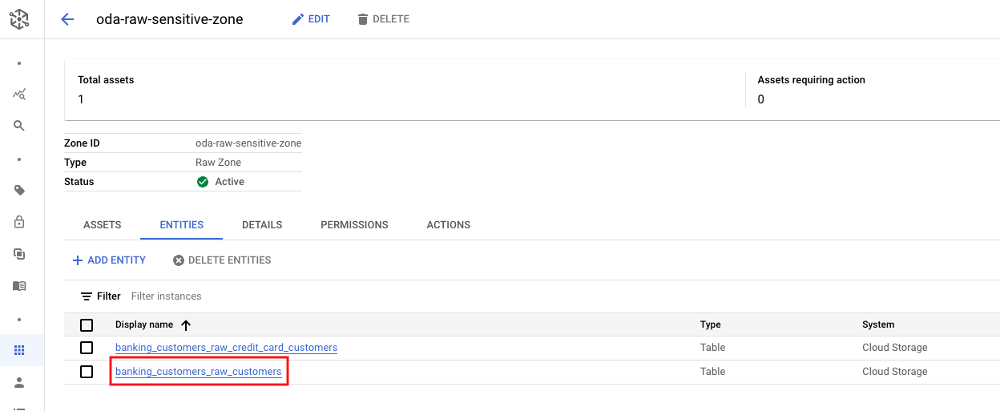

# M10-1: Data Profiling

Dataplex offers a data profiling and this lab showcases the same.

### Terminilogy Levelset

Data profiling is the analytical process of capturing useful statistics of data. The results can provide actionable insights into data quality, trends and risks, for proactive remediation to eliminate any adverse impact.


There are several types of profiling. Dataplex does column-level profiling.

### Prerequisites

Successful completion of prior modules

### Duration

30 minutes

### Documentation 

[About Data Profiling](https://cloud.google.com/dataplex/docs/data-profiling-overview)<br>
[Use Data Profiling](https://cloud.google.com/dataplex/docs/use-data-profiling)<br>


### Learning goals


<hr>

# LAB

<hr>

## 1. Data to use to showcase profiling

### 1.1. External table with Customer Master Data

We will choose this as it has email addresses, phone nubers etc that are great for checking for quality.

   
<br><br>

   
<br><br>

   
<br><br>


Familiarize yourself with the data in the BQ UI via this SQL-
```
SELECT * FROM oda_raw_sensitive_zone.banking_customers_raw_customers WHERE date='2022-05-01' LIMIT 5
```

   
<br><br>

<hr>

### 1.2. Create BigQuery managed table with Customer Master Data

#### 1.2.1. Declare variables

Paste in Cloud Shell-
```
PROJECT_ID=`gcloud config list --format "value(core.project)" 2>/dev/null`
PROJECT_NBR=`gcloud projects describe $PROJECT_ID | grep projectNumber | cut -d':' -f2 |  tr -d "'" | xargs`
LOCATION="us-central1"
LOCATION_MULTI="us"
BQ_DATASET_ID="oda_dq_zone"
UMSA_FQN="lab-sa@$PROJECT_ID.iam.gserviceaccount.com"
```

#### 1.2.2. Create a BigQuery dataset

Run this in Cloud shell-
```
bq --location=$LOCATION_MULTI mk \
    $PROJECT_ID:$BQ_DATASET_ID
```

#### 1.2.2. Create a BigQuery managed table for customer master data

In the BQ UI, run the SQL below-
```
CREATE OR REPLACE TABLE oda_dq_zone.customer_master AS
SELECT * FROM oda_raw_sensitive_zone.banking_customers_raw_customers WHERE date='2022-05-01'
```

Run a quick query to test if the table is created and also review the columns-
```
SELECT * FROM oda_dq_zone.customer_master LIMIT 20
```

   
<br><br>

