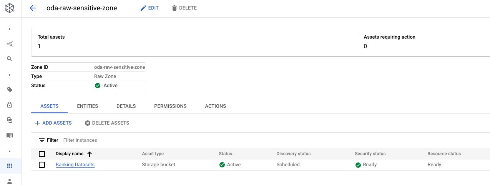
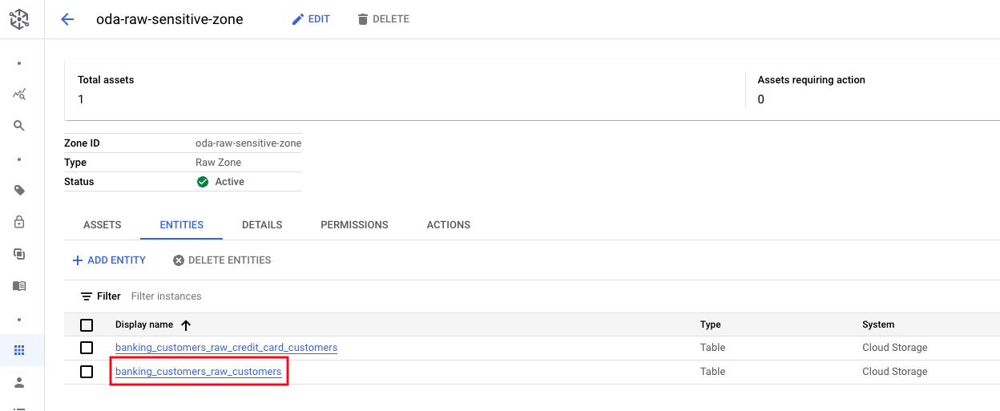
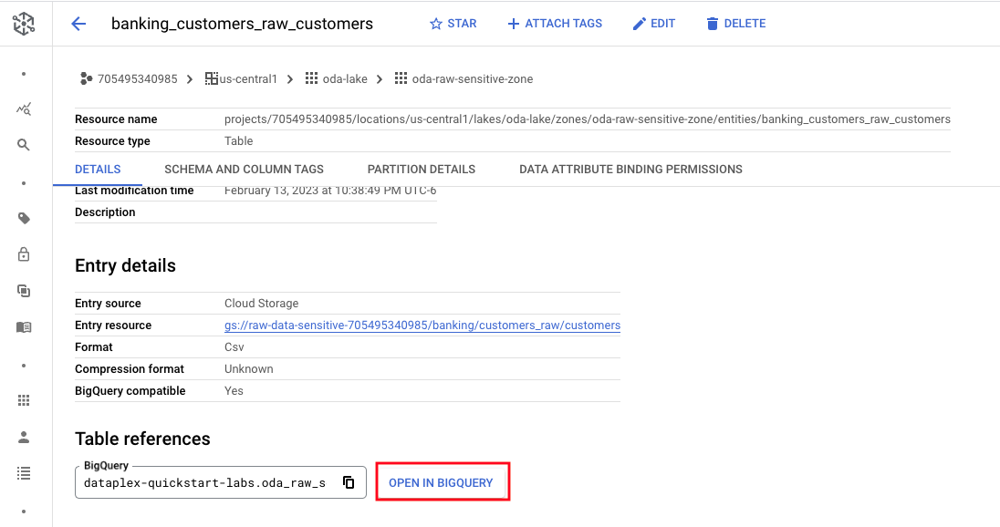
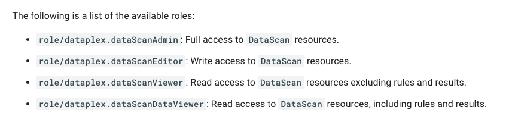

# M11-1: Data Quality - out of the box

Dataplex offers a feature called AutoDQ or automated data quality and this lab showcases the same.

### Prerequisites

Successful completion of prior modules

### Duration

30 minutes

### Documentation 

[Data Quality Overview](https://cloud.google.com/dataplex/docs/data-quality-overview)<br>
[About Auto Data Quality](https://cloud.google.com/dataplex/docs/auto-data-quality-overview)<br>
[Use Auto Data Quality](https://cloud.google.com/dataplex/docs/use-auto-data-quality)<br>


### Learning goals


<hr>

# LAB

<hr>

## 1. Data to use to showcase quality

### 1.1. External table with Customer Master Data

We will choose this as it has email addresses, phone nubers etc that are great for checking for quality.

   
<br><br>

   
<br><br>

   
<br><br>


Familiarize yourself with the data in the BQ UI via this SQL-
```
SELECT * FROM oda_raw_sensitive_zone.banking_customers_raw_customers WHERE date='2022-05-01' LIMIT 5
```

   
<br><br>


### 1.2. Create BigQuery managed table with Customer Master Data

In the BQ UI, run the SQL below-
```
CREATE OR REPLACE TABLE oda_product_zone.customer_master AS
SELECT * FROM oda_raw_sensitive_zone.banking_customers_raw_customers WHERE date='2022-05-01'
```

Run a quick query to test if the table is created and also review the columns-
```
SELECT * FROM oda_product_zone.customer_master LIMIT 20
```

   
<br><br>

<hr>

## 2. IAM permissions to run Data Quality checks

### 2.1. Predefined IAM roles

The following are the pre-defined roles available-

   
<br><br>

Lets grant our User Managed Service Account the role ```role/dataplex.dataScanAdmin```

### 2.2. Grant the User Managed Service Account the role/dataplex.dataScanAdmin role

```
# Variables
PROJECT_ID=`gcloud config list --format "value(core.project)" 2>/dev/null`
PROJECT_NBR=`gcloud projects describe $PROJECT_ID | grep projectNumber | cut -d':' -f2 |  tr -d "'" | xargs`
UMSA_FQN="lab-sa@$PROJECT_ID.iam.gserviceaccount.com"

# Permissions

gcloud projects add-iam-policy-binding ${PROJECT_ID} \
    --member=serviceAccount:${UMSA_FQN} \
    --role=roles/dataplex.dataScanAdmin
```


