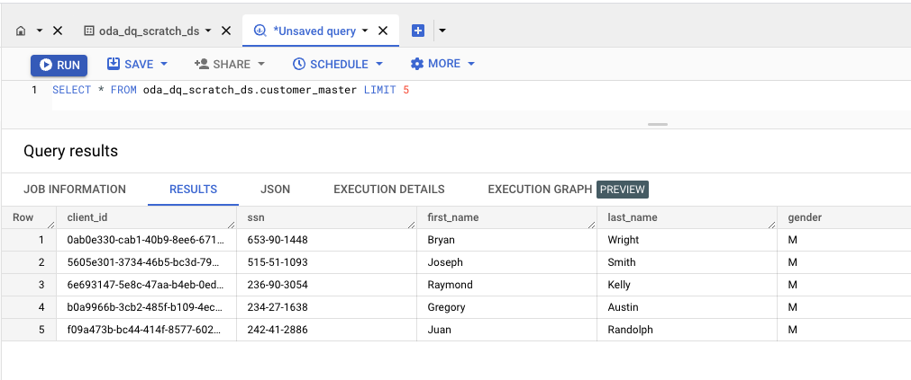
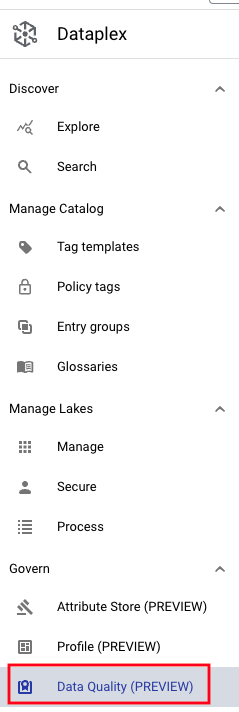

# M11-1: Auto Data Quality 

Dataplex provides the following two options to validate data quality:

**Auto data quality** (Public Preview) provides an automated experience for getting quality insights about your data. Auto data quality automates and simplifies quality definition with recommendations and UI-driven workflows. It standardizes on insights with built-in reports and drives actions through alerting and troubleshooting.

**Dataplex data quality task** (Generally Available) offers a highly customizable experience to manage your own rule repository and customize execution and results, using Dataplex for managed / serverless execution. Dataplex data quality task uses an open source component, CloudDQ, that can also open up choices for customers who want to enhance the code to their needs.

The focus of this lab module is Auto data quality.

### Prerequisites

Successful completion of prior modules

### Duration

30 minutes

### Documentation 

[Data Quality Overview](https://cloud.google.com/dataplex/docs/data-quality-overview)<br>
[About Auto Data Quality](https://cloud.google.com/dataplex/docs/auto-data-quality-overview)<br>
[Use Auto Data Quality](https://cloud.google.com/dataplex/docs/use-auto-data-quality)<br>


### Learning goals

1. Understand options for data quality in Dataplex
2. Practical knowledge of running Auto Data Quality

<hr>
<hr>

# LAB

<hr>
<hr>

## 1. Target data for Data Quality checks

We will use the same table as in the Data Profiling lab module.

   
<br><br>

Familiarize yourself with the table, from the BigQuery UI by running the SQL below-

```
SELECT * FROM oda_dq_scratch_ds.customer_master LIMIT 20

```

<hr>

## 2. Create a Data Quality scan

### 2.1. Follow the steps nelow - as depicted in the screenshots to create basic null checks

   
<br><br>

### 2.2. Lets add a validity check for SSN

### 2.3. Lets add a validity check for email


## 3. Run a Data Quality scan


