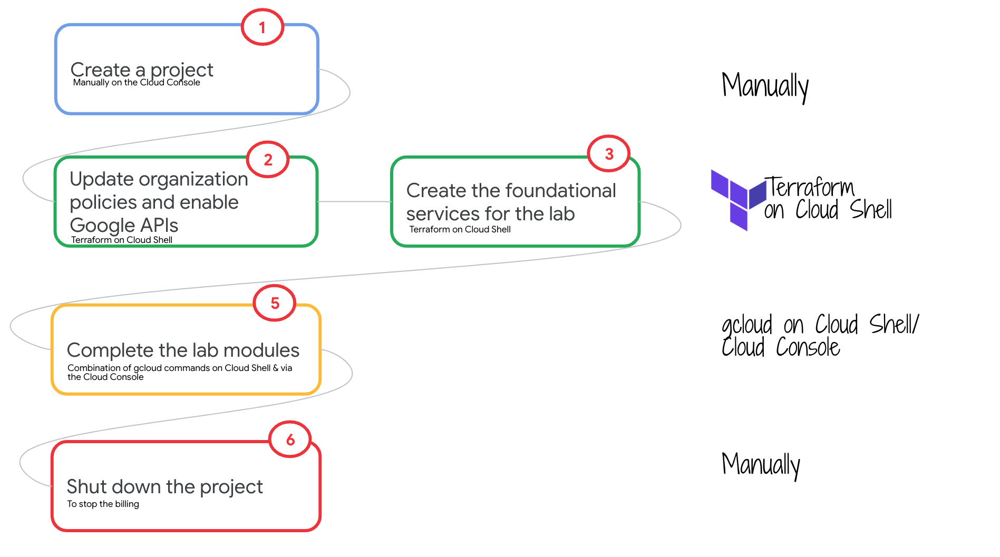

# Dataplex Quickstart for Practitioners

## 1. About

Dataplex is a Google Cloud service for Data Governance and Management. Using Dataplex and complementary Data Analytics services, enterprises can stand up Data Mesh architecture in their Google Cloud data estate. To get started with Data Mesh on Google Cloud, one of the prerequisites is knowledge of Dataplex. 

This repository is designed to demystify Dataplex features, through a series of self-contained instructional lab modules, with minimal automation, detailed instructions with screenshots for the full developer experience. Once you are well versed with dataplex, you can proceeed to the advanced labs that feature Data Mesh. The labs are product sponsored and you can expect to see new modules released as and when there are new features/updates to features announced.

## 2. Format & Duration
The lab is fully scripted (no research needed), with (fully automated) environment setup, data, code, commands, notebooks, orchestration, and configuration. Clone the repo and follow the step by step instructions for an end to end developer experience.   

Expect to spend ~8 hours to fully understand and execute if new to GCP and the services and at least ~6 hours otherwise.

## 3. Level
L200 - L300 (includes Apache Spark code, Apache Airflow orchestration, Data Science notebooks and more)

## 4. Audience
The intended audience is anyone with interest in architecting governance and Data Mesh on Google Cloud.

## 5. Prerequisites
Foundational knowledge of governance, and GCP products would be beneficial but is not entirely required, given the format of the lab. Access to Google Cloud is a must unless you want to just read the content.

## 6. Goal
Simplify your learning and adoption journey of our product stack for governance with -   
1. Just enough product knowledge of Dataplex for governance 
2. Quick start code that can be repurposed for your use cases 
3. Terraform for provisioning a variety of Google Cloud data services, that can be repurposed for your use case 

## 7. Use case covered
There are various usecases covered including Chicago Crimes Analytics, TelCo Customer Churn Prediction, Cell Tower Anomaly Detection, Icecream Sales Forecasting and more. This is an ever-evovlving lab series, we recommend reviewing the release history for updates on use cases.

## 8. Flow of the lab

   
  

For your convenience, all the code is pre-authored, so you can focus on understanding product features and integration.

## 9. The lab modules
Complete the lab modules in a sequential manner. For a better lab experience, read *all* the modules and then start working on them.
| # | Module | Duration | 
| -- | :--- | :--- |
| 01 |  | 1 hour |

## 10. Dont forget to 
Shut down/delete resources when done to avoid unnecessary billing.

## 11. Credits
| # | Google Cloud Collaborators | Contribution  | 
| -- | :--- | :--- |
| 1. | Anagha Khanolkar | Creator |

## 12. Contributions welcome
Community contribution to improve the lab is very much appreciated.  

## 13. Getting help
If you have any questions or if you found any problems with this repository, please report through GitHub issues.

## 14. Release History
| Date | Details | 
| -- | :--- | 
| 20230227 |  Initial release |

